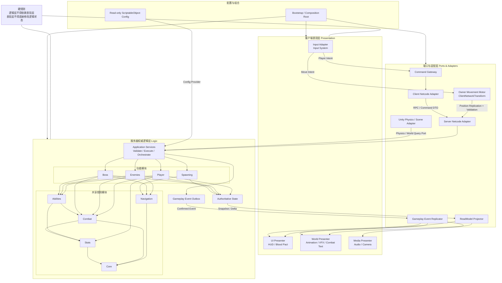

# Vampire Hunt 软件架构规范

> 状态：正式开发基线（Adopted）  
> 适用范围：`Assets/Scripts`、`Assets/Editor` 及其后续替代目录  
> 架构图源文件：[Docs/Architecture/vampire-hunt-architecture.mmd](Docs/Architecture/vampire-hunt-architecture.mmd)  
> 详细模块设计与类图：[Docs/Architecture/MODULE_DESIGN.md](Docs/Architecture/MODULE_DESIGN.md)  
> 最后更新：2026-08-19

## 1. 目的

本规范用于约束 Vampire Hunt 从原型进入正式开发后的代码结构。首要目标是：

1. **逻辑与表现严格分离**：战斗、属性、AI、奖励、刷怪和局内成长不能依赖 UI、动画、VFX、音频、相机或其他表现实现。
2. **服务器权威**：多人模式下只有服务器能够确认并修改游戏状态，客户端只提交意图并播放权威结果。唯一例外是玩家位置/朝向，采用 Owner 客户端权威 + 服务器校验（见 §8.1）。
3. **高内聚、低耦合**：功能模块对自身规则负责，跨模块只通过稳定契约交互。
4. **可验证**：依赖方向、序列化安全、网络语义和逻辑/表现边界必须能够通过自动测试检查。

本规范中的关键词含义如下：

- **必须（MUST）**：不满足即视为架构缺陷，不得合并。
- **应该（SHOULD）**：原则上遵守，偏离时必须在评审中说明理由。
- **可以（MAY）**：按具体功能选择。

## 2. 架构决策

项目采用：

> **以功能为边界的模块化单体，在模块内部使用六边形架构思想，通过 NGO 适配层实现服务器权威模拟，通过只读模型和权威事件驱动客户端表现。**

项目不采用以下总体架构：

- 不把 Unity 客户端内部拆成微服务。
- 不进行全项目 DOTS/ECS 重写；只有经过性能分析确认的热点才可局部引入。
- 不使用全局 Service Locator 或“所有消息都走全局事件总线”的结构。
- 不用传统 MVC 统领战斗、AI、网络模拟；MVC/MVVM 只用于 UI 内部。

## 3. 逻辑与表现的硬边界

### 3.1 逻辑层

逻辑层包括 Domain 与 Application：

- 玩家/敌人/Boss 属性和生命规则。
- 攻击、伤害、暴击、击退、死亡和奖励结算。
- Gameplay Ability、血契、状态效果和局内成长。
- AI 决策、Boss 阶段、刷怪压力与生成规则。
- 流场求解和可测试的导航算法。
- 用例编排、命令验证和权威结果生成。

逻辑层必须满足：

- **不得引用** `UnityEngine.UI`、TextMeshPro、Animator、ParticleSystem、AudioSource、Cinemachine、相机或任何具体 Presenter。
- Domain 应该是纯 C#；不得继承 `MonoBehaviour`、`NetworkBehaviour` 或 `ScriptableObject`。
- Application 不得使用 `GameObject.Find*`、`Find*ObjectByType`、`Camera.main` 或全局 Singleton 定位依赖。
- 不得通过动画事件、UI 回调或特效播放结果来决定伤害、奖励、刷怪或状态切换。
- 不得引用 Player、Enemies、Boss 中其他功能模块的具体 MonoBehaviour。

### 3.2 表现层

表现层包括：

- HUD、血契选择界面、调试界面。
- 动画、VFX、伤害跳字、受击闪烁、状态覆盖效果。
- 音频、Wwise 事件、相机和 Cinemachine。
- 本地输入采样与输入反馈。

表现层必须满足：

- 只能读取 `ReadModel`、状态快照或消费已经确认的 `GameplayEvent`。
- 不得直接修改生命、属性、奖励、AI、Boss 阶段、刷怪器或 NetworkVariable。
- 不得自行重新计算伤害、暴击、击杀、奖励或技能命中。
- 动画事件只能通知表现阶段或提交“意图”；服务器仍必须验证并执行真实逻辑。
- 表现缺失、禁用或运行在 Dedicated Server 时，游戏逻辑仍必须正确运行。

### 3.3 层间通信

逻辑和表现之间只允许以下四种通信形式：

1. **Command / Intent**：表现或输入层向 Application 提交玩家意图。
2. **Result**：Application 返回本次用例的明确结果。
3. **GameplayEvent**：逻辑产生的不可变权威事件，由表现层消费。
4. **ReadModel**：面向 UI/表现的只读状态投影。

玩家位置/朝向的 Owner 权威复制（§8.1）是适配层的复制通道，不属于逻辑与表现之间的通信形式，不得用它传递上述四类语义。

禁止：

- 逻辑层调用 `CombatTextService.ShowDamage`、Animator、Audio 或 VFX。
- UI 直接调用 `EnemyHealth.ChangeEnemyHealth`、`BossHealth` 或修改 Player 状态。
- 客户端根据 NetworkVariable 差值猜测暴击、来源、命中位置或瞬时事件。
- Presenter 持有可写的领域对象并绕过 Application Service。

## 4. 总体架构图

下图中的“逻辑层 → 事件输出箱 → 复制/投影适配器 → 表现层”是数据流，不代表逻辑层依赖具体表现实现。逻辑只依赖事件与端口契约。



## 5. 依赖方向

允许的程序集依赖如下。表中未列出的反向依赖一律禁止。

| 源模块 | 可以依赖 | 禁止依赖 |
|---|---|---|
| `VampireHunt.Core` | 无自研模块 | 所有功能、Unity 表现和 NGO |
| `VampireHunt.Stats` | Core | Player、Enemies、Boss、UI、NGO |
| `VampireHunt.Combat` | Core、Stats | 具体玩家/敌人/Boss、UI、动画、NGO |
| `VampireHunt.Abilities` | Core、Stats、Combat | 具体 Presenter、UI、NetworkBehaviour |
| `VampireHunt.Navigation` | Core | 具体敌人、Boss、UI、相机 |
| `VampireHunt.Player` | Core、Stats、Combat、Abilities | Enemies、Boss、UI、Presentation、NGO |
| `VampireHunt.Enemies` | Core、Stats、Combat、Abilities、Navigation | Player、Boss、UI、Presentation、NGO |
| `VampireHunt.Boss` | Core、Stats、Combat、Abilities、Navigation | Player、Enemies、UI、Presentation、NGO |
| `VampireHunt.Spawning` | Core、Navigation、通用生成契约 | PlayerNetworkState、EnemyHealth、BossHealth、UI |
| `VampireHunt.Infrastructure.Integration` | 各功能模块的公开 Contracts | 功能模块内部实现、UI、具体 Presenter |
| `VampireHunt.Infrastructure.Netcode` | Core 和所有功能模块的公开端口 | UI/TMP/动画具体实现 |
| `VampireHunt.Presentation` | Core、GameplayEvent、只读状态契约 | 领域状态写接口 |
| `VampireHunt.UI` | ReadModel、Application Command Gateway | 领域状态写接口、具体 NetworkVariable |
| `VampireHunt.Bootstrap` | 所有模块 | 无；它是唯一允许了解所有具体实现的组合根 |

**Contracts 的程序集归属**：Command、Result、GameplayEvent、ReadModel 与小型端口接口位于各功能程序集内的 `*.Contracts` 命名空间，不单独拆 asmdef。因此上表中 “UI/Presentation/Netcode 可依赖某功能的契约”在 asmdef 层表现为引用整个功能程序集；真正的边界由两道防线保证：功能程序集内非 Contracts 类型默认 `internal`（见 MODULE_DESIGN §8），以及架构测试禁止消费方引用任何非 `*.Contracts` 命名空间的类型（见 §15 守卫 8）。跨模块共享的适配器契约（`IGameplayEventIngress`、`IEntityLifecycleEventSink`、各 `I*StateSnapshotSink`）归属 `VampireHunt.Core` 的 `Core.Contracts` 命名空间。

**Authoring 资产类的归属**：`BossDefinition`、`EnemySpawnConfig` 等 ScriptableObject Authoring 类型位于各功能程序集的 `*.Authoring` 命名空间。Authoring 类型允许持有 Prefab、Material、PresentationCueId 等资产引用，但 Domain/Application 不得直接引用 Authoring 类型——必须经 `*SpecFactory` 转换为不可变 Spec 后使用；SpecFactory 位于 Authoring 命名空间，由 Bootstrap/ConfigCatalog 调用。

功能模块之间禁止直接依赖：

- Enemy 攻击玩家时，依赖 `ICombatTarget`/`IDamageReceiver`，不能依赖 `PlayerHealth`。
- Player 攻击 Boss 时，依赖 `IDamageReceiver`，不能判断 `BossHealth`/`BossGuard` 具体类型。
- Enemy 发放奖励时，依赖 `IRewardRecipient`，不能定位 `PlayerNetworkState`。
- Boss 查找目标时，依赖 `ICombatTargetQuery`，不能直接遍历玩家组件。

## 6. 目标目录与命名空间

目标结构如下；迁移期间可以逐模块建立，不要求一次完成。

```text
Assets/Scripts/VampireHunt/
├─ Core/
├─ Stats/
├─ Combat/
│  ├─ Contracts/
│  ├─ Domain/
│  └─ Application/
├─ Abilities/
├─ Navigation/
├─ Features/
│  ├─ Player/
│  │  ├─ Contracts/
│  │  ├─ Domain/
│  │  └─ Application/
│  ├─ Enemies/
│  ├─ Boss/
│  └─ Spawning/
├─ Infrastructure/
│  ├─ Integration/
│  ├─ Netcode/
│  ├─ UnityPhysics/
│  ├─ Persistence/
│  └─ Resources/
├─ Presentation/
│  ├─ Player/
│  ├─ Enemies/
│  ├─ Boss/
│  ├─ CombatText/
│  ├─ Audio/
│  ├─ Vfx/
│  └─ Camera/
├─ UI/
├─ Bootstrap/
└─ Editor/

Assets/Tests/
├─ EditMode/
├─ PlayMode/
├─ Netcode/
└─ Architecture/
```

命名空间必须与逻辑模块一致，例如：

```csharp
namespace VampireHunt.Combat.Contracts;
namespace VampireHunt.Player.Domain;
namespace VampireHunt.Infrastructure.Netcode.Player;
namespace VampireHunt.Presentation.CombatText;
```

注意：`Features/` 只是目录分组层级，不进入命名空间（`Features/Player/Domain` 的命名空间是 `VampireHunt.Player.Domain`）。每个功能模块内部统一使用 `Contracts`、`Domain`、`Application`、`Authoring` 四个子命名空间；Stats、Abilities、Navigation 与 Combat 采用相同内部结构。

目录表示代码所有权，namespace/asmdef 表示真实依赖边界。不能只移动文件而保留跨模块引用。

**asmdef 基线是迁移的第一步**。当前模块代码由 §5 定义的自研 asmdef 约束；`Assets/Scripts` 下每个 `.cs` 必须被最近的 asmdef 覆盖，不允许回落或显式引用预定义 `Assembly-CSharp`。

尚未完成职责拆分的旧 MonoBehaviour/ScriptableObject 统一隔离在最外层 `VampireHunt.Legacy` 适配器程序集。该程序集可以依赖模块 Contracts/Application 与 Bootstrap，但任何 Domain、Application 或其他运行时程序集均不得反向依赖它。随着兼容壳满足 §13 删除门槛，应将其删除或迁入对应的 Infrastructure/Presentation/Authoring 程序集，最终移除该过渡程序集。

`Assets/Tests/Architecture` 必须持续验证 asmdef 全覆盖、项目依赖图无环、Editor 程序集平台限制，以及不存在 `Assembly-CSharp` 引用。

从 Assembly-CSharp 拆出 asmdef 时，对 Wwise（`AK.Wwise.Unity.*`）、Feel/NiceVibrations、MoreMountains.Tools 等第三方程序集的引用必须在消费方 asmdef 中显式声明，且只允许出现在 Infrastructure、Presentation、UI、Bootstrap 程序集中。

## 7. 功能模块内部结构

每个功能模块按以下职责组织：

### Contracts

- 对外公开的 Command、Result、Event、ReadModel 和小型能力接口。
- 不能包含 GameObject、Transform、MonoBehaviour、NetworkObject、Animator、TMP 或具体实体组件。
- 参数优先使用 `EntityId`、数值和不可变值对象。

### Domain

- 属性计算、伤害规则、状态机、选择策略等纯逻辑。
- 不读取场景、不发 RPC、不播放表现、不加载 Resources。
- 必须可以在 EditMode 测试中直接构造并执行。

### Application

- 执行用例、校验权限、编排领域对象、提交状态和事件。
- 依赖端口接口获取物理查询、时间、随机数、目标和持久化能力。
- 不持有具体 UI、Animator 或 NetworkManager。

### Adapters

- Unity Physics、Input System、NGO、Resources、Wwise 等外部技术实现。
- 把 Unity/NGO 类型转换为逻辑层契约。
- 允许替换，但不能成为业务规则的唯一存放位置。

### Presentation

- 只消费 ReadModel 和 GameplayEvent。
- Presenter 被销毁、未加载或在 Dedicated Server 缺失时，不影响逻辑结果。

## 8. 服务器权威运行流程

### 8.1 Command 流程与移动权威模型

除移动外的所有玩法意图走统一 Command 流程：

```text
本地输入
→ Input Adapter
→ Command Gateway
→ Client RPC Adapter
→ Server RPC Adapter
→ Application Service 验证
→ Domain 执行
→ 权威状态改变
```

- 客户端提交的是瞄准位置、攻击意图、血契选择等意图。
- 客户端不得提交“造成了多少伤害”“目标已死亡”等结论。
- 离线模式必须通过 Local Adapter 调用同一套 Application/Domain 逻辑，不能维护另一套规则。

**移动权威模型（Adopted 决策）**：玩家位置/朝向采用 **Owner 客户端权威 + 服务器校验**，不采用纯服务器权威移动，也不实现完整的客户端预测/和解。

```text
本地输入
→ Input Adapter
→ Owner Movement Motor（FixedUpdate 驱动平面 Rigidbody，保留重力 Y 速度）
→ ClientNetworkTransform 复制位置到服务器与其他客户端
→ 服务器记录 Owner 最新姿态供玩法查询（不做移动反作弊或位置纠正）
```

规则：

- Owner 客户端权威**仅限**位置与朝向。生命、伤害、暴击、奖励、技能、血契、刷怪、Boss 阶段仍然完全服务器权威。
- 当前合作 PvE 不实现移动反作弊：服务器不检查 Owner 姿态的速度、时间戳、越界或穿墙，也不发送位置纠正。
- 所有以位置为输入的**权威判定**（近战命中范围、AOE 归属、刷怪距离）使用服务器最近收到的 Owner 姿态。
- Dash 作为移动的一部分由 Owner 立即执行，但 Dash 的资源消耗/冷却合法性由服务器校验；无敌帧（受击免疫窗口）是战斗规则，由服务器 `PlayerVitals` 判定。
- Dedicated Server 模式下该模型不变：Owner 仍驱动自身位移，服务器记录姿态，并继续作为其余玩法状态的唯一写入方。
- 若未来竞技性需求要求更强反作弊，升级为预测+和解模型必须走 §17 ADR 流程。

### 8.1.1 服务器模拟循环

服务器每个模拟 tick 按以下固定顺序推进；该顺序是行为契约，改动需要 ADR：

```text
1. 采集本 tick 到达的 Command（按到达顺序，同一玩家按 Sequence 去重/排序）
2. 记录 Owner 最新姿态，更新服务器侧位置查询
3. Player Command 执行（攻击、血契选择等）
4. EnemySpawnDirector.Tick（预算、采样、生成请求）
5. EnemySimulationService.Tick（感知 → Brain → Intent → Motor/Combat）
6. BossSimulationService.Tick（阶段 → 机制 → 攻击计划推进）
7. GameplayAbilitySystem.Tick（持续时间、周期效果、到期移除）
8. 死亡与奖励结算（本 tick 内所有 WasKilled 的一次性处理）
9. 状态快照采集 → State Replicator
10. Event Outbox flush → Gameplay Event Replicator
```

- 逻辑时间一律来自 `IGameClock`；其服务器实现必须基于 NGO ServerTime/tick，禁止在 Domain/Application 中直接使用 `Time.time`、`Time.deltaTime` 或 `DateTime.Now`。
- 冷却、持续时间、Boss 攻击窗口以服务器 tick 计；客户端表现可用本地时间插值，但不得回写。
- 同一 tick 内“互相击杀”按上述顺序自然裁决（先结算的一方生效），不引入额外的同时死亡规则。

### 8.1.2 EntityId 生命周期

- `EntityId` 由服务器单调递增分配，**永不复用**。
- 对象池取出实体时必须分配**全新的** EntityId；回池即该 id 永久失效。EntityId 标识“一次逻辑生命”，不标识池化的 GameObject。
- `EntityId` 与 NGO `NetworkObjectId` 是两个体系，映射关系由 `NetworkEntityRegistry` 维护；任何逻辑、事件和 ReadModel 只使用 EntityId。
- 收到携带已失效 EntityId 的事件时，Presenter 按“目标已消失”处理（例如在事件携带的世界位置播放跳字），不得报错或查找 GameObject。

### 8.2 状态复制流程

```text
权威状态
→ Netcode State Replicator
→ 客户端状态快照
→ ReadModel Projector
→ UI / World Presenter
```

- NetworkVariable 是复制机制，不是 UI API。
- UI 不直接订阅整个 `PlayerNetworkState`；它读取面向界面的只读模型。

**群怪复制规模策略**：本作目标是大量敌人同屏，敌人状态复制必须遵守以下预算规则：

- 敌人位置/朝向复制必须支持降频与量化压缩（位置半精度或定点量化），同步频率按“距离任一玩家的远近”分级；具体分级阈值属于 `EnemyStateReplicator` 配置。
- 生命值只在变化时复制；`EnemySnapshot` 走增量/脏标记，不做全量每帧广播。
- 客户端位置插值/外推属于 Presenter（`EnemyMotorAdapter` 客户端侧或 `EnemyAnimationPresenter`），逻辑层不感知插值。
- 大规模瞬时表现（如 AOE 命中 30 个敌人）应聚合为一个批量 GameplayEvent，不得逐目标发 30 条 RPC。
- 新敌人类型合入前必须在“Dedicated Server + 2 Clients + 目标同屏数量”场景下验证带宽占用。

**到达顺序原则**：状态复制与事件复制是两条独立通道，客户端可能以任意先后收到 `DamageConfirmedEvent` 与对应的血量快照。约定：**事件是触发器，快照是真相**——Presenter 播表现依据事件，显示数值依据 ReadModel，且必须容忍两者任意到达顺序与目标已回池的情况。

### 8.3 瞬时表现事件流程

```text
Domain/Application 产生 GameplayEvent
→ Server Event Outbox
→ Gameplay Event Replicator
→ 所有目标客户端
→ CombatText / Animation / VFX / Audio Presenter
```

伤害表现事件必须携带服务器确认的：

- 实际伤害值，而不是请求伤害。
- 是否暴击。
- `sourceId`、`targetId`。
- 命中世界位置。
- 可选的伤害类型和表现标签。

敌人可能在事件到达客户端前回池，因此 Presenter 不能要求目标 GameObject 仍然存在。

## 9. 契约设计规范

推荐的战斗契约形态：

```csharp
public readonly struct DamageRequest
{
    public EntityId SourceId { get; }
    public EntityId TargetId { get; }
    public int BaseDamage { get; }
    public HitContext Hit { get; }
}

public readonly struct ResolvedDamage
{
    public EntityId SourceId { get; }
    public EntityId TargetId { get; }
    public int FinalDamage { get; }
    public bool WasCritical { get; }
    public HitContext Hit { get; }
}

public readonly struct DamageResult
{
    public int RequestedDamage { get; }
    public int AppliedDamage { get; }
    public bool WasCritical { get; }
    public bool WasKilled { get; }
    public WorldPosition HitPosition { get; }
}

public interface IDamageReceiver
{
    DamageResult ApplyDamage(in ResolvedDamage damage);
}
```

约束：

- 接口必须小而专一，禁止重新创建类似当前“大而全 Host”的接口。
- 没有能力的实体不得通过空方法满足接口；应拆分成独立能力接口。
- 通用战斗接口必须位于 Combat，而不是 Boss、Player 或 Enemy 目录。
- Result 必须返回实际结果，调用方不能通过实体具体类型和前后血量猜测结果。
- Domain Event 必须是不可变数据，不包含 Unity 对象引用。
- 设计文档中出现但未展开定义的值对象（`CommandResult`、`MoveVector`、`DamageTag`、`SpawnRequest`、`AttackIntent`、`RewardGrant` 等）在实现时一律按本节规范补齐为不可变 struct/record，不视为设计遗漏。

## 10. ScriptableObject 与运行时状态

ScriptableObject 用于可编辑的定义和调参，例如：

- `PlayerDefinition`
- `EnemyDefinition`
- `BossDefinition`
- `EnemySpawnConfig`
- `BloodPactDefinition`
- `GameplayEffectDefinition`

规则：

- 运行时不得修改共享配置资产。
- 局内堆叠、生命、冷却、状态持续时间等必须存放在 Runtime State。
- Domain 读取的是不可变配置接口或配置快照，不直接调用 `Resources.Load`。
- `Resources.Load`、Addressables 和 Inspector 引用统一由 Config Provider/Bootstrap 解析。
- 包含 Prefab、Material、AnimationClip 的资产属于 Authoring/Presentation/Infrastructure 配置，不得泄漏到纯 Domain。

## 11. 表现层规范

### UI

- HUD 使用 `IPlayerHudReadModel` 等只读接口。
- UI 操作通过 Command Gateway 提交，不能持有可写领域对象。
- 血契候选生成、费用判断和选择确认属于服务器 Application；UI 只展示候选和提交选择。

### 动画与 VFX

- Animator 参数和特效由 Presenter 根据状态快照或 GameplayEvent 驱动。
- 动画事件不得直接扣血；最多通知 Presenter 或提交经服务器验证的窗口意图。
- 运行时创建材质、Mesh、LineRenderer 的代码必须位于 Presentation 工厂，不得位于攻击逻辑。

### 伤害跳字

- `CombatTextService` 属于 Presentation。
- 逻辑层只产生 `DamageConfirmedEvent`。
- 多人游戏中由服务器广播实际伤害事件，所有客户端各自在本地对象池中显示。

### 音频与相机

- 业务逻辑只能产生 `AudioCueId`、`CameraCueId` 等表现标签。
- Wwise、AudioSource、Cinemachine 由各自 Presenter/Adapter 解析标签。
- 禁止逻辑层调用 `SFXManager.Instance`、`AudioManager.Instance` 或 `Camera.main`。

## 12. NGO 与对象池规范

- `NetworkBehaviour` 应位于 `Infrastructure.Netcode`；功能逻辑不引用 NGO。
- RPC 方法只负责验证发送方、反序列化 DTO、调用 Application 和复制结果。
- 服务器是生命、伤害、暴击、奖励、AI、刷怪和 Boss 阶段的唯一写入方。玩家位置/朝向按 §8.1 采用 Owner 权威复制（ClientNetworkTransform 或等价实现），并由服务器 Movement Validator 校验，这是唯一允许的客户端写入通道。
- ClientRpc/通用 Rpc 中的表现调用必须先转化为 GameplayEvent，再交给 Presenter。
- 网络对象池必须通过生命周期接口完整重置生命、状态效果、AI、移动、动画标记和临时修正器。
- 不得同时启用多个相互独立的权威刷怪入口。
- Dedicated Server 不得依赖 Camera、Animator、UI、Audio 或本地屏幕可见性才能推进模拟。

迁移期间允许保留单个 `PlayerNetworkState`/Enemy/Boss NetworkBehaviour 作为稳定外壳，但它必须逐步退化为：

1. 网络输入入口。
2. 状态复制器。
3. GameplayEvent 复制器。
4. 对 Application/Domain 的适配器。

不得继续向其中添加新的玩法规则。

## 13. 当前系统迁移映射

全部现有运行时脚本必须归入以下三态之一：**迁移**（职责移入目标模块）、**保留**（本身就是合法的 Presenter/Adapter/Editor 工具，就地纳入对应程序集）、**删除**（原型残留）。未列入本表的新脚本不得再加入 Assembly-CSharp。

### 13.1 迁移：职责拆分

| 当前组件 | 逻辑目标 | 表现/适配目标 |
|---|---|---|
| `PlayerNetworkState` | PlayerVitals、PlayerProgression、PlayerAbilityHost、Combat Application | PlayerStateReplicator、CombatEventReplicator、PlayerReadModelProjector |
| `PlayerController` | Attack Command UseCase（移动本地化，见 §8.1） | PlayerInputAdapter、OwnerMovementMotor、CameraRigBinder、PlayerAnimatorPresenter |
| `Player Movement.cs` | 服务器侧 IMovementValidator 规则 | OwnerMovementMotor（Owner 权威位移） |
| `PlayerDash` | DashPolicy（消耗/冷却规则，服务器校验） | OwnerMovementMotor 的 Dash 执行、DashVfxPresenter |
| `PlayerHurtInvincible` | PlayerVitals 无敌窗口规则（服务器） | HurtFlashPresenter |
| `PlayerAttact` | MeleeAttackResolver、DamageApplicationService | PlayerAttackPresenter、SwordSlashVfxFactory、PlayerAudioPresenter |
| `PlayerRunStats` | Stats 模块 StatCalculator/StatModifierCollection | 无 |
| `Player Health.cs` | PlayerVitals | PlayerHudPresenter 经 ReadModel |
| `EnemyHealth` | EnemyVitals、EnemyRewards、EnemyAbilityHost | EnemyStateReplicator、EnemyStatusPresenter |
| `EnemyKnockBack` | KnockbackResolver（Combat）、IKnockbackReceiver 实现 | EnemyMotorAdapter 的击退位移执行 |
| `EnemyCombat` | EnemyCombatPolicy、EnemyCombatService | EnemyAnimationPresenter |
| `Shoot` / `EnemyShoot` | RangedAttackPolicy、IProjectileSpawner 端口（见 MODULE_DESIGN §5） | EnemyProjectileAdapter、ProjectileVfxPresenter |
| `ChasingEnemy` / `EnemyMovement` | EnemyBrain 追击策略 | EnemyMotorAdapter |
| `FlowFieldEnemy` | EnemyBrain、EnemyCombatPolicy | EnemyMotorAdapter、EnemyAnimationPresenter、EnemyStateReplicator |
| `FlowFieldManager` | FlowGrid、FlowFieldSolver | FlowFieldWorldAdapter、FlowFieldDebugPresenter |
| `BossController` / `BossControllerServices` | BossStateMachine、BossEncounterService | BossStateReplicator、BossPresenter |
| `BossAttackController` | 独立 BossAttackStrategy | Telegraph/Vfx/Projectile Adapter |
| `BossBehaviorPolicy` | BossAttackSelector、BossPhaseStateMachine | 无 |
| `BossGuard` | BossEncounterState 格挡/减伤/破防规则 | BossGuardVfxPresenter |
| `BossHealth` | BossVitals | BossStateReplicator |
| `BossProjectile` | 服务器投射物模拟（BossAttackService 推进） | BossProjectileAdapter（视图与插值） |
| `BossPhaseEnvironment` | BossPhaseService 触发的 GameplayEvent | EnvironmentPresenter 消费事件 |
| `BossConfig` | BossDefinition 与独立攻击 Definition（Authoring） | BossAuthoring 组件保存场景/表现引用 |
| `BossCombatInterfaces` / `BossPublicApi` | 并入 Combat/Boss Contracts，删除宽接口 | 无 |
| `CombatTextService` | 无逻辑职责 | 保留为 DamageConfirmedEvent 的本地 Presenter |
| `BloodPactSelectionController` | BloodPactOfferService、SelectBloodPact UseCase | BloodPactView、BloodPactReadModel |
| `BloodPactConfig` / `BloodPactDefinition` | BloodPact Authoring + 不可变 Spec | 无 |
| `GameplayAbilitySystem` / `GameplayAbilityDefinitions` | Abilities 模块（按 MODULE_DESIGN §3.4 收窄接口） | Cue 事件由 Presenter 消费 |
| `GameplayTagContainer` | Abilities/Core 值对象 | 无 |
| `EnemyInstanceStatModifiers` | Stats 模块 StatModifierCollection | 无 |
| `NetworkBloodPactState` | BloodPactLoadout（Domain） | Netcode 状态复制器 |
| `NetworkEnemyDebuffState` | ActiveGameplayEffect（Domain） | Netcode 状态/事件复制器 |
| `NetworkPlayerRegistry` | ICombatTargetQuery 的数据来源之一 | NetworkEntityRegistry（Netcode） |
| `NetworkAuthority` | 无逻辑职责 | 并入 Netcode 适配层的权威判定辅助 |
| 两套刷怪器（`MonsterSpawnPoint`、`PlayerProximityMonsterSpawner`） | EnemySpawnDirector（唯一权威入口） | NetworkSpawnAdapter、PoolAdapter、SpawnDebugPresenter |
| `SpawnPointsAimBoss` | SpawnCandidateSampler 规则 | SpawnLocationQueryAdapter |
| `MonsterSpawnConfig` / `EnemyStatsConfig` / `PlayerStatsConfig` | 各自 Authoring + 不可变 Spec | 无 |

### 13.2 保留：本身即 Presenter/Adapter/工具

以下脚本职责合法，迁移时移入对应程序集并按规范改名/清理即可：

- Presentation：`EnemyAnimationController`、`EnemyHurtFlash`、`EnemyStatusVfxPresenter`、`EnemyStatusVfxConfig`、`Boss3DAnimationPresenter`、`BillboardSprite`、`PerspectiveSpriteSorting`
- Presentation.Audio：`AudioManager`、`SFXManager`、`BgmVolumeSync`、`SFXVolumeSync`（去 Singleton 化，改为消费 AudioCueId 事件）
- Presentation.Camera：`TopDownCamera`、`CameraSpriteViewLock`、`CinemachineScrollZoom`
- UI：`PlayerHudController`、`UILoader`
- Infrastructure：`NetworkRuntimeLauncher`、`BossNetworkPrefabRegistrar`、`InputMapInitializer`、`PlayerRootMotionDriver`（Motor 适配）、`RoadSpline`
- Editor：`GridBuilderCatalog`、`GridBuilderTool`、`RoadSplineEditor`、`VampireHuntNetworkSetup`、`DefaultEnemy3DBuilder`、`Boss3DSceneInstaller`

### 13.3 删除

- `TopDownPrototype`：原型入口，职责被 Bootstrap 取代后删除。
- `Enemy/New Folder/` 目录：内容并入 Enemies 模块后删除该目录（目录名违反 §14）。

迁移原则是“保留外壳、移动职责、切换调用、验证行为、最后删除外壳”，禁止一次性推倒重写。

## 14. 命名、序列化与资产安全

- 类型、文件名使用 PascalCase；私有字段使用 `_camelCase`；布尔值使用 `Is/Has/Can/Should`。
- 使用 `Enemy` 作为统一领域术语，不再混用 `Monster`，除非确实代表不同概念。
- 禁止 `PlayerAttact`、`Attackfalse`、`EnemyDetectionPonint`、`Format1` 等拼写错误或无语义名称。
- 文件移动和类型重命名必须保留 `.meta` GUID。
- namespace/类型迁移使用 `MovedFrom`。
- 序列化字段重命名使用 `FormerlySerializedAs`。
- 序列化或联网枚举保留显式数值。
- AnimationEvent/UnityEvent 旧入口在过渡期使用 `[Obsolete]` 转发，资产迁移完成后删除。
- 所有 Builder、Installer、Prefab 生成器必须和运行时代码在同一次迁移中更新。
- 禁止用文本批量替换 Scene/Prefab YAML 代替 Unity 序列化迁移。

## 15. 自动化架构守卫

`Assets/Tests/Architecture` 必须逐步加入以下检查：

1. 自研 asmdef 依赖图无环。
2. Domain/Application 程序集不引用 UI、TMP、Cinemachine、Wwise、NGO 和 Presentation 程序集。
3. Player、Enemies、Boss 程序集不相互引用。
4. Domain/Application 源码不出现 `GameObject.Find`、`Find*ObjectByType`、`Camera.main`、`NetworkManager.Singleton` 或全局 `Instance`。
5. Build Scene、NetworkPrefab、Resources 和 Addressables 中零 Missing Script。
6. 所有 ScriptableObject 配置在运行前完成有效性验证。
7. Editor Builder 生成的 Prefab/Scene 通过相同验证器。
8. UI、Presentation、Netcode、Integration 源码引用功能程序集时，只允许引用 `*.Contracts` 命名空间的类型（Bootstrap 除外）。
9. Domain/Application 源码不引用 `*.Authoring` 命名空间类型（SpecFactory 输出的 Spec 除外）。

逻辑测试至少覆盖：

- 属性修正器顺序和叠加。
- 每个唯一目标独立暴击与命中去重。
- DamageResult 的实际伤害、过量伤害和死亡判定。
- Gameplay Effect 的叠层、持续时间、周期伤害和移除。
- Owner FixedUpdate 平面运动保留 Rigidbody 的重力 Y 速度，服务器姿态记录不回拉自由落体。
- 受击无敌窗口内伤害归零且不产生 DamageConfirmedEvent 表现噪声。
- Boss 阶段阈值和攻击选择策略。
- FlowFieldSolver 可达性、障碍恢复和边界。
- 刷怪压力、全局上限和池容量计算。
- 模拟循环顺序（§8.1.1）下同 tick 互伤、死亡与周期伤害的确定性结果。

网络回归至少覆盖：

- Host + 1 Client。
- Dedicated Server + 2 Clients。
- Owner 权威移动复制、重力下落同步和一次性伤害结算。
- 每目标暴击、奖励归属、共享猩红和血契选择。
- 所有客户端收到服务器确认的伤害表现事件。
- 事件先于/晚于状态快照到达时 Presenter 的行为一致。
- Enemy/Boss 回池重置、EntityId 不复用、Late Join 和阶段同步。
- 目标同屏敌人数量下的复制带宽预算。

## 16. Code Review 架构检查表

每个新增功能或重构 PR 必须回答：

- [ ] 规则位于 Domain/Application，而不是 Presenter、RPC 或 MonoBehaviour 回调中。
- [ ] Dedicated Server 在没有 UI、Animator、Audio、Camera 时仍能运行该功能。
- [ ] 表现层只消费 Result、GameplayEvent 或 ReadModel。
- [ ] 客户端没有自行确认伤害、暴击、奖励、刷怪或阶段切换。
- [ ] 客户端权威写入仅限位置/朝向复制通道，且对应的服务器校验规则已存在。
- [ ] 没有引入 Player↔Enemy、Player↔Boss 等具体类型依赖。
- [ ] 新配置位于 ScriptableObject，运行时状态没有写回资产。
- [ ] 没有新增全局 Singleton、场景搜索或隐藏的 Resources 依赖。
- [ ] Prefab/Scene/Builder 的序列化迁移已验证。
- [ ] EditMode、PlayMode 和需要的 Netcode 测试已覆盖。
- [ ] 命名表达领域含义且不存在拼写错误。

## 17. 例外流程

如果确实需要违反本规范，必须在 `Docs/Architecture/ADR` 新增一份 Architecture Decision Record，至少说明：

1. 需要解决的问题。
2. 无法遵守现有边界的原因。
3. 评估过的替代方案。
4. 影响范围和测试方案。
5. 是否临时、清理期限和负责人。

未经 ADR 记录的反向依赖、逻辑/表现混合和客户端权威写入不得合并。
