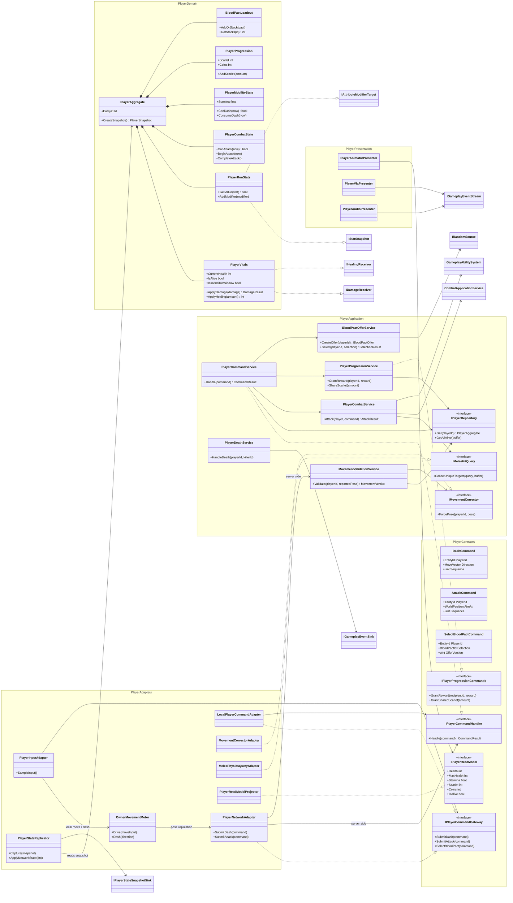
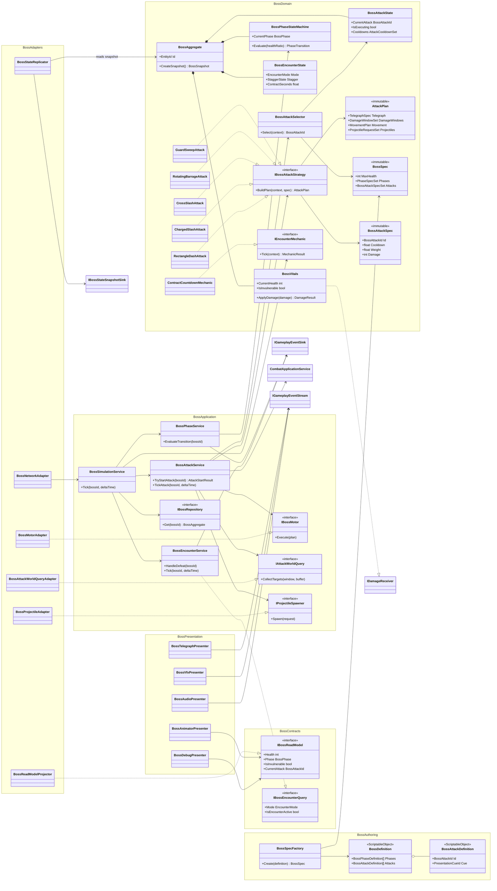
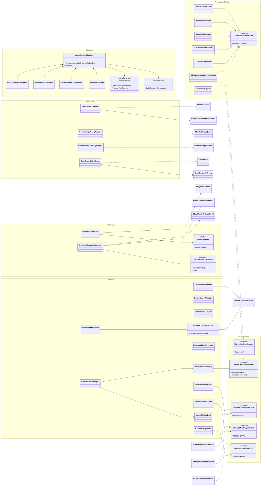

# Vampire Hunt 详细模块设计与类图

> 上位规范：[ARCHITECTURE.md](../../ARCHITECTURE.md)  
> 状态：目标设计（Target Design）  
> 适用原则：逻辑层不依赖表现层；表现层不直接修改逻辑状态  
> 最后更新：2026-08-19

## 1. 文档边界

本文把总体架构进一步落实到模块、核心类、公开端口、数据所有权和适配器。类图描述目标设计，不表示必须一次性创建所有类型；迁移时应按照上位规范逐个替换现有职责。

图中约定：

- `Domain`、`Application` 属于逻辑层。
- `Adapters` 负责 Unity、NGO、物理、资源和输入等技术接入。
- `Presentation` 只负责 UI、动画、VFX、音频、相机和调试显示。
- `..|>` 表示实现接口，`*--` 表示生命周期所有权，`-->` 表示单向依赖。
- 逻辑产生 `Result`、`GameplayEvent`、状态快照；它不持有任何 Presenter。

类图中的 `PlayerAdapters`、`EnemyAdapters`、`BossAdapters` 是按功能标注的视觉分组，不代表这些类与 Domain 放在同一程序集：Network 类型必须位于 `VampireHunt.Infrastructure.Netcode.<Feature>`，Unity Physics 类型位于 `VampireHunt.Infrastructure.UnityPhysics`，Presenter 必须位于 `VampireHunt.Presentation.<Feature>`。功能程序集本身只包含 Contracts、Domain、Application 和 Authoring 四个命名空间（Contracts 与 Authoring 的归属与访问规则见 ARCHITECTURE §5）。

## 2. 模块总览

| 模块 | 数据所有权 | 主要公开入口 | 主要输出 | 不得拥有 |
|---|---|---|---|---|
| Core | 通用不可变值对象 | Clock、Random、Event Sink | EntityId、时间、随机值 | 玩法规则、Unity 对象 |
| Stats | 属性定义和修正器集合 | StatCalculator | StatSnapshot | Player/Enemy/Boss 具体状态 |
| Combat | 通用战斗规则 | CombatApplicationService | DamageResult、Combat Event | Animator、VFX、实体具体类型 |
| Abilities | Ability/Effect 运行实例 | GameplayAbilitySystem | Modifier、Execution、Cue Event | UI、NetworkVariable、资源奖励空实现 |
| Player | 每个玩家的权威局内状态 | PlayerCommandHandler | PlayerSnapshot、GameplayEvent | UI、相机、敌人/Boss 具体类型 |
| Navigation | 流场网格、求解结果和缓存 | INavigationField | 方向、可达性、恢复格 | Enemy MonoBehaviour、动画 |
| Enemies | 每个敌人的权威状态和 AI 意图 | EnemySimulationService | EnemySnapshot、GameplayEvent | PlayerNetworkState、BossHealth |
| Spawning | 全局刷怪进度、预算和上限 | EnemySpawnDirector | SpawnRequest | 具体网络预制体实例化细节 |
| Boss | Boss 权威阶段、攻击和机制状态 | BossSimulationService | BossSnapshot、GameplayEvent | PlayerHealth、具体 Presenter |
| Integration | 不拥有领域状态，只桥接跨功能端口 | Feature Port Adapter | Command/Result 转发 | 新玩法规则、Presenter |
| Netcode | 网络复制状态，不是领域真相 | Command/State/Event Adapter | DTO、Snapshot、Confirmed Event | 伤害/奖励/Boss 规则 |
| Presentation | 客户端临时表现状态 | GameplayEvent Handler | 动画、VFX、音频、相机反馈 | 领域状态写入 |
| UI | 本地 View 状态 | ReadModel、Command Gateway | 用户意图 | NetworkVariable、领域实体 |
| Bootstrap | 对象图和配置解析 | GameCompositionRoot | 完整运行时组合 | 玩法规则 |

## 3. Core、Stats、Combat、Abilities

### 3.1 Core

Core 只提供跨模块稳定原语：

- `EntityId`：服务器单调递增分配、**永不复用**的逻辑实体标识。对象池取出实体即分配新 id，回池即失效（详见 ARCHITECTURE §8.1.2）；与 NGO `NetworkObjectId` 分离，由 `NetworkEntityRegistry` 维护映射。
- `WorldPosition`：不暴露 Transform 的位置值对象，由 Adapter 与 `Vector3` 转换。
- `IGameClock`：逻辑时间来源；服务器实现基于 NGO ServerTime/tick，测试可使用 Fake Clock。
- `IRandomSource`：服务器随机来源；暴击、候选和攻击选择可复现测试。
- `IGameplayEventSink`：Application 发布不可变事件的输出端口。
- `Core.Contracts` 命名空间承载跨模块适配器契约：`IGameplayEventIngress`、`IEntityLifecycleEventSink`、各 `I*StateSnapshotSink`（见 §7.5）。

Core 不得定义“万能 Manager”、全局 Singleton 或可变实体注册表。

### 3.2 Stats

- `StatKey` 是共享属性标识；模块可在自身 Contracts 中声明合法键集合。
- `StatModifierCollection` 拥有局内修正器，支持按来源移除、叠层和重算。
- `StatCalculator` 实现统一公式，不在 Player、Enemy、Boss 各自复制一套算法。
- 配置基础值和运行时修正器必须分离。`IStatSnapshot` 由持有“基础值 + 修正器”组合的 feature 级类型实现（如 `PlayerRunStats`）；`StatModifierCollection` 本身不实现 `IStatSnapshot`（它没有基础值）。Snapshot 是评估时刻的不可变拷贝，不是活视图。

### 3.3 Combat

- `CombatApplicationService` 是改变生命的**唯一入口**——包括直接伤害、周期伤害和治疗。任何绕过它修改生命的路径都是架构缺陷。
- `DamageRequest` 表达攻击意图；`DamageResult` 返回实际伤害、暴击和死亡结果。`DamageRequest` 携带 `DamageFlags`（如 `NoCritical`、`Periodic`），周期伤害以 `NoCritical | Periodic` 结算，不伪造普通攻击命中/暴击事件。
- 治疗经 `ApplyHealing(HealingRequest)` 走同一服务，产生 `HealingConfirmedEvent`（治疗跳字的唯一事件来源）。
- `IDamageReceiver`、`IHealingReceiver`、`IKnockbackReceiver` 是小型能力接口。
- `ICombatEntityDirectory` 按 `EntityId` 解析 `IDamageReceiver`/`IHealingReceiver` 等能力（id → 实体目录端口，由 Integration/Netcode 侧实现）；`ICombatTargetQuery` 是空间查询端口，两者职责不同。
- 击退经 `KnockbackResolver` 计算力度/免疫后调用 `IKnockbackReceiver`；击退位移的执行属于 Motor Adapter。
- `DamageConfirmedEvent` 只在服务器完成结算后产生。
- **死亡编排约定**：Combat 只负责产生 `EntityDiedEvent` 与 `DamageResult.WasKilled`；死亡后果（奖励、回池、Encounter 结束、玩家倒地）由各功能模块的 DeathService 订阅/检查后执行——Enemy 为 `EnemyDeathService`，Player 为 `PlayerDeathService`，Boss 为 `BossEncounterService`。同一实体的死亡结算必须恰好一次，由模拟循环第 8 步（ARCHITECTURE §8.1.1）统一驱动。

### 3.4 Abilities

- `GameplayEffectSpec` 是从 ScriptableObject 定义生成的不可变运行规格。
- `ActiveGameplayEffect` 是每个目标独立的运行实例。
- `GameplayEffectExecutor` 根据 Execution 类型分别依赖能力接口：伤害与治疗 Execution 必须经 `CombatApplicationService` 结算（不得直连 `IDamageReceiver`），属性 Execution 依赖 `IAttributeModifierTarget`。
- 不再使用要求所有宿主实现奖励、伤害、治疗等全部方法的宽接口。
- 周期伤害产生 DamageConfirmedEvent（带 Periodic 标记），但不得递归伪造普通攻击命中/暴击事件。

### 3.5 共享内核类图

```mermaid
classDiagram
direction LR

namespace Core {
    class EntityId {
        <<valueObject>>
        +ulong Value
        +IsValid bool
    }
    class WorldPosition {
        <<valueObject>>
        +float X
        +float Y
        +float Z
    }
    class IGameClock {
        <<interface>>
        +Now double
        +DeltaTime float
    }
    class IRandomSource {
        <<interface>>
        +NextFloat() float
        +NextInt(min, max) int
    }
    class IGameplayEvent {
        <<interface>>
        +EventId ulong
        +OccurredAt double
    }
    class IGameplayEventSink {
        <<interface>>
        +Publish(event)
    }
}

namespace Stats {
    class StatKey {
        <<valueObject>>
        +ushort Value
    }
    class ModifierOperation {
        <<enumeration>>
        AddFlat
        AddPercent
        Multiply
        Override
    }
    class StatModifier {
        <<valueObject>>
        +StatKey Stat
        +ModifierOperation Operation
        +float Magnitude
        +EntityId SourceId
    }
    class StatModifierCollection {
        +Add(modifier)
        +RemoveBySource(sourceId)
        +Snapshot() IStatSnapshot
    }
    class StatCalculator {
        +Evaluate(baseValue, modifiers) float
    }
    class IStatSnapshot {
        <<interface>>
        +GetValue(key) float
    }
}

namespace Combat {
    class DamageFlags {
        <<enumeration>>
        None
        NoCritical
        Periodic
    }
    class DamageRequest {
        <<valueObject>>
        +EntityId SourceId
        +EntityId TargetId
        +int BaseDamage
        +DamageFlags Flags
        +HitContext Hit
    }
    class HealingRequest {
        <<valueObject>>
        +EntityId SourceId
        +EntityId TargetId
        +int BaseHealing
    }
    class HitContext {
        <<valueObject>>
        +WorldPosition Position
        +DamageTag DamageTag
    }
    class ResolvedDamage {
        <<valueObject>>
        +EntityId SourceId
        +EntityId TargetId
        +int FinalDamage
        +bool WasCritical
        +HitContext Hit
    }
    class DamageResult {
        <<valueObject>>
        +int RequestedDamage
        +int AppliedDamage
        +bool WasCritical
        +bool WasKilled
        +WorldPosition HitPosition
    }
    class IDamageReceiver {
        <<interface>>
        +ApplyDamage(damage) DamageResult
    }
    class IHealingReceiver {
        <<interface>>
        +ApplyHealing(amount) int
    }
    class IKnockbackReceiver {
        <<interface>>
        +ApplyKnockback(impulse)
    }
    class KnockbackResolver {
        +Resolve(request, targetStats) KnockbackImpulse
    }
    class ICombatTarget {
        <<interface>>
        +Id EntityId
        +IsAlive bool
        +Position WorldPosition
    }
    class ICombatTargetQuery {
        <<interface>>
        +FindClosest(query) ICombatTarget
        +CollectInArea(query, buffer)
    }
    class ICombatEntityDirectory {
        <<interface>>
        +TryGetDamageReceiver(id) IDamageReceiver
        +TryGetHealingReceiver(id) IHealingReceiver
        +TryGetKnockbackReceiver(id) IKnockbackReceiver
    }
    class CombatResolver {
        +Resolve(request, sourceStats) ResolvedDamage
    }
    class CombatApplicationService {
        +ApplyDamage(request) DamageResult
        +ApplyHealing(request) HealingResult
    }
    class DamageConfirmedEvent {
        +DamageResult Result
        +EntityId SourceId
        +EntityId TargetId
    }
    class HealingConfirmedEvent {
        +int AppliedHealing
        +EntityId SourceId
        +EntityId TargetId
    }
    class EntityDiedEvent {
        +EntityId EntityId
        +EntityId KillerId
    }
}

namespace Abilities {
    class GameplayEffectSpec {
        <<immutable>>
        +EffectId Id
        +DurationPolicy Duration
        +StackingPolicy Stacking
    }
    class ActiveGameplayEffect {
        +EntityId SourceId
        +float RemainingTime
        +int StackCount
        +Tick(deltaTime)
    }
    class GameplayAbilitySystem {
        +Apply(spec, sourceId)
        +RemoveBySource(sourceId)
        +Tick(deltaTime)
    }
    class GameplayEffectExecutor {
        +Execute(effect, context)
    }
    class IAttributeModifierTarget {
        <<interface>>
        +AddModifier(modifier)
        +RemoveModifiers(sourceId)
    }
    class GameplayCueEvent {
        +CueId Cue
        +EntityId TargetId
        +WorldPosition Position
    }
}

StatModifier --> StatKey
StatModifier --> ModifierOperation
StatModifier --> EntityId
StatModifierCollection o-- StatModifier
StatModifierCollection --> StatCalculator

DamageRequest --> EntityId
DamageRequest --> HitContext
DamageRequest --> DamageFlags
HitContext --> WorldPosition
ResolvedDamage --> EntityId
ResolvedDamage --> HitContext
DamageResult --> WorldPosition
CombatApplicationService --> CombatResolver
CombatApplicationService --> ICombatEntityDirectory
CombatApplicationService --> IGameplayEventSink
KnockbackResolver --> IKnockbackReceiver
CombatResolver --> IRandomSource
DamageConfirmedEvent ..|> IGameplayEvent
HealingConfirmedEvent ..|> IGameplayEvent
EntityDiedEvent ..|> IGameplayEvent

GameplayAbilitySystem *-- ActiveGameplayEffect
ActiveGameplayEffect --> GameplayEffectSpec
GameplayAbilitySystem --> GameplayEffectExecutor
GameplayEffectExecutor --> CombatApplicationService : damage / healing
GameplayEffectExecutor --> IAttributeModifierTarget
GameplayEffectExecutor --> IGameplayEventSink
GameplayCueEvent ..|> IGameplayEvent
```



## 4. Player 模块

### 4.1 数据所有权

每个玩家在服务器拥有一个 `PlayerAggregate`：

- `PlayerVitals`：生命、存活、受伤/治疗规则，以及受击无敌窗口（无敌期内伤害归零且不产生表现事件）。
- `PlayerRunStats`：基础属性快照和局内修正器。
- `PlayerCombatState`：攻击冷却、攻击窗口、目标级结算上下文。
- `PlayerMobilityState`：体力、Dash 冷却与消耗合法性（服务器校验用；Dash 位移本身由 Owner 客户端执行，见 ARCHITECTURE §8.1）。
- `PlayerProgression`：猩红、金币和升级进度。
- `BloodPactLoadout`：已选择血契和堆叠状态。

Aggregate 不包含 Animator、Transform、NetworkVariable、TMP 或 AudioSource。玩家位置不属于 Aggregate 状态——它由 Owner 权威复制通道维护，服务器侧经 Movement Validator 校验后的位置通过 `ICombatTargetQuery` 提供给权威判定。

### 4.2 Application Services

- `PlayerCommandService`：服务器命令总入口，验证所有权、存活状态和命令序列。
- `MovementValidationService`：按服务器时间校验 Owner 上报位置（速度上限含 Dash 增益、越界、穿墙），失败时强制纠正；它取代了原设计中的服务器权威 `PlayerMovementService`。
- `PlayerCombatService`：验证攻击窗口，通过 `IMeleeHitQuery` 获取目标并调用 Combat。
- `PlayerDeathService`：一次性处理玩家死亡（倒地/复活规则、掉落、Encounter 通知）。
- `PlayerProgressionService`：结算猩红、金币、升级和共享资源。
- `BloodPactOfferService`：服务器生成候选、校验费用和执行选择。

攻击目标去重、逐目标暴击和实际伤害必须在 PlayerCombatService/Combat 中完成，不能在 Presenter 中完成。

### 4.3 Player 类图



### 4.4 现有类迁移

| 现有类 | 第一阶段保留职责 | 移出的职责 |
|---|---|---|
| `PlayerNetworkState` | NGO 状态/RPC 外壳、DTO 转换 | Vitals、Progression、GAS、暴击、CombatText 调用 |
| `PlayerController` | 暂时绑定 Prefab 和组件 | Input、Camera、Attack Command 分离；移动改为 OwnerMovementMotor |
| `Player Movement.cs` | Owner 本地位移的过渡实现 | 服务器校验规则移入 MovementValidationService |
| `PlayerDash` | Owner 本地 Dash 执行 | 消耗/冷却合法性移入 PlayerMobilityState（服务器） |
| `PlayerHurtInvincible` | 受击闪烁表现 | 无敌窗口判定移入 PlayerVitals（服务器） |
| `PlayerAttact` | 兼容旧序列化/动画入口 | 命中查询、伤害、VFX、音频全部迁出 |
| `PlayerRunStats` | 可复用算法经测试后迁移 | Player 专属枚举与通用 ModifierOperation 解耦 |

## 5. Navigation、Enemies、Spawning

### 5.1 Navigation

- `FlowGrid` 只保存格子、成本和邻接关系。
- `FlowFieldSolver` 是纯算法，输入网格与目标格，输出不可变 FlowField。
- `FlowFieldCache` 以目标和 obstacleRevision 为键缓存结果。
- `FlowFieldWorldAdapter` 扫描 Unity 场景、转换世界坐标并实现 `INavigationField`。
- Gizmo 属于 `FlowFieldDebugPresenter`，不进入求解器。

### 5.2 Enemies

- `EnemyBrain` 根据感知快照生成 `EnemyIntent`，不直接移动 Transform。
- `EnemySimulationService` 编排 Brain、Motor、Combat 和 Ability。
- `EnemyVitals` 处理生命；`EnemyDeathService` 负责一次性死亡和奖励用例。
- 远程敌人（现有 `Shoot`/`EnemyShoot`）通过 `EnemyCombatPolicy` 产生远程 `AttackIntent`，`EnemyCombatService` 经 `IProjectileSpawner` 端口发射服务器权威投射物；投射物命中由服务器结算并走 CombatApplicationService，客户端只播放投射物视图与插值。
- 击退作为 `DamageResult`/攻击附带效果由 KnockbackResolver 计算，`EnemyMotorAdapter` 执行位移（对应现有 `EnemyKnockBack`）。
- 奖励通过 `IRewardService` 发放，不依赖 PlayerNetworkState。
- 动画、受击闪烁和状态 VFX 只消费 EnemySnapshot/GameplayEvent。
- 敌人状态复制遵守 ARCHITECTURE §8.2 群怪复制规模策略（降频、量化、脏标记、批量事件）。

### 5.3 Spawning

- 全场只存在一个权威 `EnemySpawnDirector`。
- `SpawnPressurePolicy` 根据时间/阶段生成预算，不实例化 Prefab。
- `SpawnCandidateSampler` 依赖 `ISpawnLocationQuery` 选择合法位置。
- `IEnemySpawner` 隐藏 NGO Spawn 和对象池。
- `EnemySpawnConfig` ScriptableObject 必须转换成不可变 `EnemySpawnSpec`。

### 5.4 Enemy、导航、刷怪类图

```mermaid
classDiagram
direction LR

namespace NavigationDomain {
    class FlowCell {
        +CellIndex Index
        +bool IsWalkable
        +ushort Cost
    }
    class FlowGrid {
        +GetCell(index) FlowCell
        +GetNeighbors(index, buffer)
    }
    class FlowField {
        +GetDirection(index) Direction
        +CanReach(index) bool
    }
    class FlowFieldSolver {
        +Solve(grid, target) FlowField
    }
    class FlowFieldCache {
        +GetOrBuild(target, obstacleRevision) FlowField
        +Invalidate(revision)
    }
    class INavigationField {
        <<interface>>
        +SampleDirection(position, target) Direction
        +IsWalkable(position) bool
        +TryFindRecovery(position) WorldPosition
    }
}

namespace EnemyDomain {
    class EnemyAggregate {
        +EntityId Id
        +CreateSnapshot() EnemySnapshot
        +ResetForSpawn(spec)
    }
    class EnemyVitals {
        +CurrentHealth int
        +IsAlive bool
        +ApplyDamage(damage) DamageResult
    }
    class EnemyBrain {
        +Decide(perception) EnemyIntent
    }
    class EnemyCombatPolicy {
        +CanAttack(context) bool
        +CreateAttackIntent(context) AttackIntent
    }
    class EnemyRewardPolicy {
        +CreateReward(deathContext) RewardGrant
    }
    class EnemyPerception {
        +TargetId EntityId
        +Distance float
        +HasLineOfTravel bool
    }
}

namespace EnemyApplication {
    class EnemySimulationService {
        +Tick(enemyId, deltaTime)
    }
    class EnemyCombatService {
        +Execute(enemyId, attackIntent)
    }
    class EnemyDeathService {
        +HandleDeath(enemyId, killerId)
    }
    class IEnemyRepository {
        <<interface>>
        +Get(enemyId) EnemyAggregate
    }
    class IEnemyMotor {
        <<interface>>
        +Move(enemyId, intent)
        +Knockback(enemyId, impulse)
        +Stop(enemyId)
    }
    class IEnemyProjectileSpawner {
        <<interface>>
        +Spawn(request)
    }
    class IRewardService {
        <<interface>>
        +Grant(recipientId, reward)
    }
}

namespace EnemyContracts {
    class IEnemyReadModel {
        <<interface>>
        +Health int
        +IsAlive bool
        +State EnemyState
        +Position WorldPosition
    }
}

namespace SpawningDomain {
    class EnemySpawnDirector {
        +Tick(context)
        +ResetForRun()
    }
    class SpawnPressurePolicy {
        +CalculateBudget(elapsed, phase) SpawnBudget
    }
    class SpawnBudget {
        +int Requested
        +int Available
        +int Granted
    }
    class SpawnCandidateSampler {
        +TrySample(context) SpawnCandidate
    }
    class EnemySpawnSpec {
        <<immutable>>
        +int MaxAlive
        +int PoolPrewarm
        +float SpawnInterval
    }
    class ISpawnLocationQuery {
        <<interface>>
        +IsValid(position) bool
        +SampleAround(target) WorldPosition
    }
    class IEnemySpawner {
        <<interface>>
        +Spawn(request) EntityId
        +ActiveCount int
    }
    class ISpawnGate {
        <<interface>>
        +CanSpawn(context) bool
    }
}

namespace EnemyAdapters {
    class FlowFieldWorldAdapter
    class FlowFieldDebugPresenter
    class SpawnLocationQueryAdapter
    class EnemyMotorAdapter
    class EnemyProjectileAdapter
    class EnemyNetworkAdapter
    class EnemyStateReplicator
    class NetworkEnemySpawner
    class NetworkEnemyPool
    class EnemyReadModelProjector
}

namespace EnemyPresentation {
    class EnemyAnimationPresenter
    class EnemyStatusVfxPresenter
    class EnemyHurtFlashPresenter
}

FlowGrid *-- FlowCell
FlowFieldSolver --> FlowGrid
FlowFieldSolver --> FlowField
FlowFieldCache o-- FlowField
FlowFieldCache --> FlowFieldSolver
FlowFieldWorldAdapter ..|> INavigationField
FlowFieldWorldAdapter --> FlowFieldCache
FlowFieldDebugPresenter --> INavigationField
SpawnLocationQueryAdapter ..|> ISpawnLocationQuery
SpawnLocationQueryAdapter --> INavigationField

EnemyAggregate *-- EnemyVitals
EnemyAggregate *-- EnemyBrain
EnemyAggregate *-- EnemyCombatPolicy
EnemyAggregate *-- EnemyRewardPolicy
EnemyVitals ..|> IDamageReceiver
EnemyBrain --> INavigationField
EnemyBrain --> ICombatTargetQuery
EnemyBrain --> EnemyPerception
EnemySimulationService --> IEnemyRepository
EnemySimulationService --> EnemyBrain
EnemySimulationService --> IEnemyMotor
EnemySimulationService --> EnemyCombatService
EnemyCombatService --> CombatApplicationService
EnemyCombatService --> IEnemyProjectileSpawner
EnemyDeathService --> EnemyRewardPolicy
EnemyDeathService --> IRewardService
EnemyDeathService --> IGameplayEventSink
EnemyMotorAdapter ..|> IEnemyMotor
EnemyNetworkAdapter --> EnemySimulationService
EnemyStateReplicator --> EnemyAggregate : reads snapshot
EnemyStateReplicator --> IEnemyStateSnapshotSink

EnemySpawnDirector --> SpawnPressurePolicy
EnemySpawnDirector --> SpawnCandidateSampler
EnemySpawnDirector --> IEnemySpawner
EnemySpawnDirector --> ISpawnGate
EnemySpawnDirector --> EnemySpawnSpec
SpawnPressurePolicy --> SpawnBudget
SpawnCandidateSampler --> ISpawnLocationQuery
EnemyProjectileAdapter ..|> IEnemyProjectileSpawner
NetworkEnemySpawner ..|> IEnemySpawner
NetworkEnemySpawner --> NetworkEnemyPool

EnemyReadModelProjector ..|> IEnemyReadModel
EnemyAnimationPresenter --> IEnemyReadModel
EnemyStatusVfxPresenter --> IGameplayEventStream
EnemyHurtFlashPresenter --> IGameplayEventStream
```



### 5.5 生命周期规则

对象池取出敌人时，必须通过一个明确的 `ResetForSpawn` 用例重建：Vitals、Brain、Combat、Abilities、临时 Modifier、Debuff、计时器和事件序号，并分配**全新的 EntityId**（ARCHITECTURE §8.1.2：EntityId 永不复用，旧 id 随回池永久失效）。Presenter 可以单独重置动画/VFX，但不能负责恢复领域状态。

## 6. Boss 模块

### 6.1 数据与配置

- `BossDefinition` 是 ScriptableObject Authoring 资产，位于 `VampireHunt.Boss.Authoring` 命名空间（归属规则见 ARCHITECTURE §5）。
- `BossSpecFactory` 把它转换成不含 Unity 引用的 `BossSpec`。
- 每个攻击使用语义化的 `BossAttackSpec`，不再使用 Format1/2/3/4/6。
- `ContractCountdownMechanic` 是 Encounter Mechanic，不属于攻击策略。

### 6.2 领域对象

- `BossAggregate` 拥有 Vitals、阶段状态机、Encounter 状态和当前攻击状态。
- `BossPhaseStateMachine` 只根据权威生命比例/事件切换阶段。
- `BossEncounterState` 拥有格挡/护盾（对应现有 `BossGuard`）：格挡减伤系数、破防条件与硬直（Stagger）转换是 Domain 规则，在 `BossVitals.ApplyDamage` 结算链中生效；格挡特效只是事件的表现。
- `BossAttackSelector` 依据阶段、冷却和权重选择攻击 ID。
- `IBossAttackStrategy` 根据上下文生成 `AttackPlan`；它不创建 GameObject、LineRenderer 或 NetworkObject。
- `AttackPlan` 包含预警、伤害窗口、移动和投射物请求，由 Application 通过端口执行。
- Boss 死亡/Encounter 结束由 `BossEncounterService` 一次性编排（清场规则、奖励、阶段环境还原），对应 Player/Enemy 的 DeathService。

### 6.3 Boss 类图



### 6.4 攻击执行边界

Boss 攻击的逻辑与表现必须按以下方式拆分：

```text
BossAttackStrategy 生成 AttackPlan
→ BossAttackService 按服务器时间推进计划
→ WorldQuery 获取命中目标
→ CombatApplicationService 结算
→ DamageConfirmedEvent / TelegraphEvent / AttackCueEvent
→ Netcode Replicator
→ 客户端 Telegraph、Animation、VFX、Audio Presenter
```

预警图形和动画长度不能成为服务器攻击窗口的唯一时间来源。

## 7. Infrastructure.Netcode、Presentation、UI、Bootstrap

### 7.1 Netcode

- Feature Network Adapter 把 RPC/NetworkVariable DTO 转换成 Command、Snapshot 和 GameplayEvent。
- 客户端命令只存在 Player 一条通道（`IPlayerCommandHandler`）；Enemy 与 Boss 是纯服务器驱动，不接受任何客户端玩法命令。调试/作弊命令如需网络通道，单独走 `IDebugCommandHandler` 并在非开发构建中禁用。
- 玩家位置/朝向经 Owner 权威复制通道（ClientNetworkTransform 或等价实现）同步，服务器侧交 `MovementValidationService` 校验（ARCHITECTURE §8.1）。
- `NetworkEntityRegistry` 只维护 EntityId 到网络实体句柄的映射，不暴露完整 PlayerNetworkState。
- `GameplayEventReplicator` 复制瞬时事件；`StateReplicator` 复制持久状态。两通道相互独立，客户端必须容忍任意到达顺序（“事件是触发器，快照是真相”，见 ARCHITECTURE §8.2）。
- `NetworkSpawnAdapter` 和 `NetworkObjectPool` 处理实例化、回收和 NGO PrefabHandler。
- Netcode 不引用 TMP、Animator、VFX、Camera 或 UI View。

### 7.2 Presentation

- `ClientGameplayEventDispatcher` 在客户端按事件类型分发给 Presenter。
- `EntityViewRegistry` 只映射 EntityId 到本地 View，不是领域实体注册表。
- CombatText、Animator、VFX、Audio、Camera Presenter 可以同时消费同一事件。
- Presenter 不向领域对象写状态；需要操作时只能提交 Command。

### 7.3 UI

- Presenter 依赖 ReadModel 和 Command Gateway。
- View 只负责控件和用户事件，不查找 PlayerNetworkState。
- 血契 Offer 的候选和版本来自服务器快照；客户端只提交选择 ID 和 offerVersion。

### 7.4 Bootstrap

- `GameCompositionRoot` 是唯一知道所有具体类型的位置。
- `ConfigCatalog` 解析 Inspector、Resources 或 Addressables 配置，并生成逻辑 Spec。
- `SceneBindings` 保存场景级引用；其他模块不得再次全场查找。
- Offline 与 Netcode 使用相同 Application/Domain，仅替换 Command、State、Event 适配器。

### 7.5 运行时适配与表现类图



## 8. 公开 API 规则

跨功能用例通过 Integration Adapter 连接。例如 `EnemyDeathService` 定义 `IRewardService` 输出端口，`PlayerRewardAdapter` 在 `Infrastructure.Integration` 中实现该端口并调用 Player Progression 的公开 Command。该适配器可以依赖两个模块的 Contracts，但 Player 与 Enemies 仍不得直接依赖彼此。

同类适配器还包括：

- `CombatTargetQueryAdapter`：把实体注册信息投影为通用 `ICombatTargetQuery`（空间查询）。
- `CombatEntityDirectoryAdapter`：实现 `ICombatEntityDirectory`，按 EntityId 解析伤害/治疗/击退能力接口。
- `BossSpawnGateAdapter`：读取服务器侧 `IBossEncounterQuery`（Boss Contracts 中的权威状态查询，不是面向 UI 的 ReadModel），转换为刷怪模块的 `ISpawnGate` 门控。
- `PlayerRewardAdapter`：把敌人奖励与共享猩红请求交给 PlayerProgressionService。

Integration Adapter 不得承载伤害、奖励公式或阶段规则；它只做类型转换和用例转发。

每个功能模块只在 `Contracts` namespace 暴露跨模块类型：

- Command、Result、GameplayEvent、ReadModel。
- 必要的小型输入/输出 Port。
- EntityId 和不可变值对象。

默认使用 `internal`：

- Aggregate 内部实体和策略实现。
- Application Service 的辅助类。
- 具体攻击策略、AI Policy、计算器和状态机。

禁止公开：

- 具体 MonoBehaviour 作为跨模块 API。
- 可写集合或可写 Domain State。
- `NetworkVariable`、`NetworkObject`、Animator、Transform、TMP 控件。
- 为兼容旧代码而永久公开的 Setter。

## 9. 数据与生命周期

| 数据 | 权威所有者 | 生命周期 | 客户端表示 |
|---|---|---|---|
| 玩家生命/属性/血契 | PlayerAggregate（服务器） | 一局或玩家会话 | PlayerSnapshot/ReadModel |
| 玩家位置/朝向 | Owner 客户端（服务器校验，ARCHITECTURE §8.1） | 玩家会话 | Owner 权威复制 + 他人插值 |
| 敌人生命/AI/状态效果 | EnemyAggregate（服务器） | 每次从池取出到归还（每次取出分配新 EntityId） | EnemySnapshot/GameplayEvent |
| Boss 阶段/攻击/倒计时 | BossAggregate（服务器） | Boss Encounter | BossSnapshot/GameplayEvent |
| 刷怪压力/预算/上限 | EnemySpawnDirector（服务器） | 一局 | 可选调试 ReadModel |
| FlowField | Navigation Cache | obstacleRevision/目标变化 | 无需直接复制 |
| 伤害跳字/动画/VFX | 客户端 Presenter | 瞬时 | 本地对象池/Animator 状态 |
| UI 选择状态 | UI Presenter | 本地界面会话 | 不属于领域真相 |

## 10. 设计完成条件

模块设计落地后必须满足：

- [ ] Domain/Application 程序集对 Presentation、UI、NGO 的引用数为零。
- [ ] Player、Enemies、Boss 不相互引用具体类型。
- [ ] 每种伤害与治疗都通过 CombatApplicationService 返回实际结果，没有绕过入口的生命修改路径。
- [ ] 每个 GameplayEffect 只依赖它实际需要的能力接口，没有空实现方法。
- [ ] 所有 Presenter 都可以被移除而不改变服务器结果。
- [ ] Dedicated Server 不创建 UI、Animator、VFX、音频和相机对象。
- [ ] Offline 与网络模式共用相同 Domain/Application。
- [ ] State Replication 与瞬时 GameplayEvent Replication 分离，Presenter 容忍任意到达顺序。
- [ ] 客户端权威写入仅限位置/朝向通道，且 MovementValidationService 的校验规则已生效。
- [ ] 刷怪只有一个权威 EnemySpawnDirector。
- [ ] 对象池复用通过 Aggregate Reset 和 Presenter Reset 分别完成，且每次取出分配新 EntityId。
- [ ] ScriptableObject 只作为配置来源，运行状态不写回资产。
- [ ] 架构测试能够阻止反向依赖重新进入代码库。
