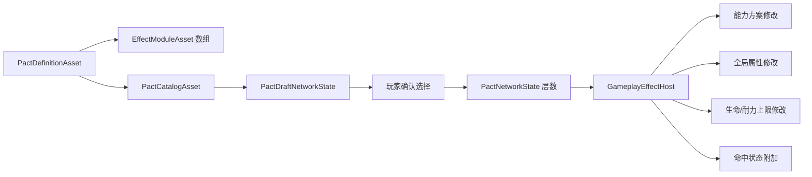

# 《血族狂猎》血契制作指南

> 适用工程：当前 `Assets/VampireHunt` 架构  
> 更新日期：2026-08-25  
> 目标读者：玩法策划、数值策划、Unity 内容制作人员和后续效果模块开发者

## 1. 文档目标

本文说明如何使用当前项目的 ScriptableObject 和模块化效果系统制作血契，包括：

- 血契定义、抽取规则和运行时效果之间的关系。
- 全局属性、资源上限、指定能力、命中状态和复合血契的制作方式。
- 层数、百分比、前置、互斥、权重和稀有度的实际计算规则。
- 哪些效果模块可以直接用于血契，哪些模块只能用于状态效果。
- 如何把血契加入正式抽取池，以及如何排查常见配置错误。
- 工程内附带的 5 个示例血契及其具体配置。

本文只描述当前代码已经支持的行为。文档中没有把尚未实现的设计当成现有功能。

## 2. 当前血契运行链路



各部分职责如下：

- `PactDefinitionAsset`：血契身份、文案、抽取规则、层数上限和效果模块列表。
- `EffectModuleAsset`：一个可复用的效果配置，例如“最大生命每层 +15%”。
- `PactCatalogAsset`：本次运行允许抽取的全部血契定义。
- `PactDraftNetworkState`：生成选项、处理刷新和确认请求。
- `PactNetworkState`：保存并同步玩家已经获得的血契及层数。
- `GameplayEffectHost`：根据血契层数安装或更新对应运行时模块。

血契 Asset 本身不直接修改玩家。它只组合效果模块，由效果模块连接到对应的运行时端口。

## 3. 推荐目录和命名

正式内容建议放置在：

```text
Assets/VampireHunt/Data/Pacts/
Assets/VampireHunt/Data/Effects/Pacts/
```

推荐命名方式：

```text
Pacts/CrimsonVitality.asset
Effects/Pacts/CrimsonVitalityMaxHealth.asset
Effects/Pacts/CrimsonVitalityMoveSpeed.asset
```

原则：

- 一个 `PactDefinitionAsset` 表示一张血契。
- 一个效果模块 Asset 表示一个独立数值贡献。
- 同一张血契可以组合多个效果模块。
- 效果模块可以被多个血契复用，但修改共享模块会同时改变所有引用者。
- 文件名使用稳定的英文或拼音标识；玩家可见名称和说明使用 `displayName`、`description`。

本指南附带的示例放在独立目录，不会自动混入正式抽取池：

```text
Assets/VampireHunt/Data/Pacts/Examples/
Assets/VampireHunt/Data/Effects/Pacts/Examples/
```

## 4. 制作一张血契的标准流程

### 4.1 先确定效果归属

先判断要强化的内容属于哪一类：

| 目标 | 应使用的模块 |
| --- | --- |
| 全局伤害、暴击、移动速度、攻击距离、击退、全局冷却、Dash 消耗 | `Attribute Modifier` |
| 最大生命、最大耐力 | `Resource Capacity Modifier` |
| 指定类型攻击的伤害、弹丸数、扩散、穿透、飞行距离、冷却 | `Ability Plan Modifier` |
| 指定攻击命中时施加燃烧、寒霜等状态 | `Apply Status On Hit` |
| 一张血契同时产生多项强化 | 在同一个 Pact 中挂多个模块 |
| 立即治疗、恢复耐力、增加猩红或魔币 | 当前血契模块不支持，需要独立的一次性资源效果 |
| 生命/耐力恢复速度 | 当前没有对应模块，需要新增 `ResourceRegenerationModifier` |

不要为了方便把所有字段都加入 `AbilityPlanModifier`。角色全局属性、资源上限和一次能力释放的方案属于不同生命周期。

### 4.2 创建效果模块 Asset

在 Project 窗口中右键，根据需要选择：

```text
Create/Vampire Hunt/Effects/Attribute Modifier
Create/Vampire Hunt/Effects/Resource Capacity Modifier
Create/Vampire Hunt/Effects/Ability Plan Modifier
Create/Vampire Hunt/Effects/Apply Status On Hit
```

把创建的 Asset 移动到 `Assets/VampireHunt/Data/Effects/Pacts/`，并按血契名称加效果后缀。

### 4.3 创建血契定义 Asset

在 Project 窗口中右键选择：

```text
Create/Vampire Hunt/Progression/Pact Definition
```

将其放入 `Assets/VampireHunt/Data/Pacts/`，配置身份、抽取规则和效果模块。

### 4.4 加入正式 Catalog

打开：

```text
Assets/VampireHunt/Data/Pacts/PactCatalog.asset
```

把新建的 `PactDefinitionAsset` 加入 `Definitions` 数组。只有加入当前玩家所引用 Catalog 的血契才会参与抽取。

不要只创建 Asset 而遗漏 Catalog；这种情况下 Asset 本身有效，但游戏永远不会抽到它。

## 5. Pact Definition 字段说明

### 5.1 Identity

| 字段 | 说明 |
| --- | --- |
| `Pact Id` | 大于 0 的运行时稳定 ID；在同一个 Catalog 中必须唯一 |
| `Display Name` | UI 显示名称 |
| `Description` | UI 显示说明；应准确描述每层或一次性效果 |
| `Icon` | 血契卡片图标；允许暂时为空 |

`Pact Id` 不是 Unity `.meta` GUID。

- `Pact Id` 用于网络同步、前置条件、互斥条件和运行时查找。
- `.meta` GUID 用于 Unity Asset 引用，由 Unity 管理。
- 已经用于正式内容的 `Pact Id` 不应随意修改。
- 复制一张血契 Asset 后，第一件事是分配新的 `Pact Id`。

当前 `PactCatalog` 在发现重复 ID 时会抛出 `Duplicate PactId`，重复项不会被自动修复或覆盖。

建议为示例、实验和正式内容划分 ID 段，例如：

```text
1-999      正式血契
1000-1999  示例和开发内容
2000-2999  活动或实验内容
```

这只是内容约定，代码目前没有强制区间。

### 5.2 Roll Rules

| 字段 | 当前实际含义 |
| --- | --- |
| `Tier` | `Normal`、`Advanced`、`Ultimate` 的内容标签；当前抽取器不会仅凭 Tier 自动锁定或解锁 |
| `Rarity` | 运气对权重的放大参数；不是直接概率，也不会自动决定 Tier |
| `Base Weight` | 抽取基础权重，相对值越大越常见 |
| `Tags` | 血契内容分类，用于策划和未来筛选；不是攻击的 `DamageTags` |
| `Prerequisites` | 玩家必须已经拥有的 Pact Id 列表 |
| `Exclusions` | 与当前血契互斥的 Pact Id 列表 |
| `Repeatable` | 是否允许重复获得并叠层 |
| `Max Stacks` | 可重复血契的最大层数；不可重复血契运行时固定为 1 |

当前权重计算为：

```text
最终权重 = BaseWeight × (1 + Luck × (Rarity - 1) × 0.1)
```

注意：

- `Base Weight` 是相对权重，不是百分比。
- 当前实现会把最终权重限制到至少 `0.0001`，所以把 `Base Weight` 设为 0 不能可靠禁用血契。
- 要禁用一张血契，应把它从正式 Catalog 移除。
- `Prerequisites` 和 `Exclusions` 填写的是 Pact Id 数字，不是 Asset 引用。
- 互斥检查会同时检查候选血契和已拥有血契的 `Exclusions`，单边声明也能阻止另一张进入候选池；为了策划可读性，正式内容仍建议双边填写。
- 当前 `repeatable` 是显式配置，不由 Tier 自动决定。

### 5.3 Runtime Effects

`Effect Modules` 是效果模块 Asset 数组。

模块按数组顺序创建。通常每个模块只负责一个字段，这样更容易复用、平衡和定位问题。

例如“移动速度 +8%，Dash 消耗 -10%”应使用两个 `AttributeModifierModuleAsset`，而不是制作一个包含两个无关字段的专用脚本。

## 6. 层数和数值计算

### 6.1 通用层数值

当前属性模块、资源上限模块和能力方案模块都使用：

```text
效果值 = Constant Value + Per Stack Value × 当前血契层数
```

血契层数从 1 开始。

| 目标 | Constant | Per Stack | 1 层 | 2 层 | 3 层 |
| --- | ---: | ---: | ---: | ---: | ---: |
| 每层 +10% | 0 | 0.10 | 0.10 | 0.20 | 0.30 |
| 首层 +20%，之后每层 +10% | 0.10 | 0.10 | 0.20 | 0.30 | 0.40 |
| 不可重复、固定 +25% | 0.25 | 0 | 0.25 | 不适用 | 不适用 |

文案中的“每层”必须与实际公式一致。最常见的错误是同时填写 `Constant Value` 和完整的 `Per Stack Value`，导致第一层多算一次。

### 6.2 Attribute 和 Resource Capacity 运算

这两类模块共用三种运算：

| Operation | 含义 | 典型用途 |
| --- | --- | --- |
| `Flat` | 直接加数值 | 暴击率 +0.05、生命上限 +20 |
| `AdditivePercent` | 与其他同类百分比相加 | 伤害 +10%、移动速度 +8% |
| `Multiplicative` | 每个来源独立相乘 | 少量独立倍率来源 |

最终值公式：

```text
最终值 = (基础值 + Flat 总和)
       × max(0, 1 + AdditivePercent 总和)
       × Multiplicative 来源乘积
```

例如基础伤害 10，同时拥有两个 `AdditivePercent +10%` 来源：

```text
10 × (1 + 0.1 + 0.1) = 12
```

如果是两个独立 `Multiplicative +10%` 来源：

```text
10 × 1.1 × 1.1 = 12.1
```

当前单个血契内部的多层数值仍先线性计算；系统没有提供 `1.1 ^ stacks` 的层数复利模式。

## 7. 各类血契的制作方法

### 7.1 全局属性型：Attribute Modifier

适合修改所有相关能力或系统都会读取的玩家属性。

字段：

| 字段 | 说明 |
| --- | --- |
| `Attribute` | 选择一个 `StatDefinition` |
| `Operation` | `Flat`、`AdditivePercent` 或 `Multiplicative` |
| `Constant Value` | 每个效果来源固定贡献 |
| `Value Per Stack` | 每层血契增加的贡献 |

当前已经接入的主要属性：

| StatDefinition | 当前消费者 | 常见强化方式 |
| --- | --- | --- |
| `DamageStat` | `CombatAbilityHost` | `AdditivePercent +0.1/层` |
| `CooldownStat` | `CombatAbilityHost` | `AdditivePercent -0.1/层` |
| `WeaponRangeStat` | `CombatAbilityHost` | `AdditivePercent` 或 `Flat` |
| `CritRateStat` | `CombatAbilityHost` | 通常用 `Flat +0.05` 表示增加 5 个百分点 |
| `CritDamageStat` | `CombatAbilityHost` | `Flat` 或 `AdditivePercent` |
| `KnockbackForceStat` | `CombatAbilityHost` | `Flat` 或 `AdditivePercent` |
| `MoveSpeedStat` | `CoreMovement` 的属性解析器 | `AdditivePercent` |
| `DashStaminaCostStat` | `DashAddon` | 使用负的 `AdditivePercent` 降低消耗 |

不要用 Attribute Modifier 修改以下内容：

- `HealthStat` 当前值：这会把“当前生命”当成派生属性，不是治疗。
- `StaminaStat` 当前值：这不是恢复耐力。
- `CoinStat` 或 `ScarletStat` 当前值：资源增减必须走对应的权威资源接口。
- 最大生命和最大耐力：使用 Resource Capacity Modifier。

常用配方：

```text
全局伤害每层 +10%
Attribute = DamageStat
Operation = AdditivePercent
Constant = 0
Per Stack = 0.10

暴击率固定增加 5 个百分点
Attribute = CritRateStat
Operation = Flat
Constant = 0.05
Per Stack = 0

全局冷却每层降低 10%
Attribute = CooldownStat
Operation = AdditivePercent
Constant = 0
Per Stack = -0.10
```

### 7.2 资源上限型：Resource Capacity Modifier

适合最大生命和最大耐力。它在服务器上以 `StatDefinition.maxValue` 为基础重算运行时上限，不会永久修改基础 Stat Asset。

字段：

| 字段 | 说明 |
| --- | --- |
| `Resource` | 当前应选择 `HealthStat` 或 `StaminaStat` |
| `Operation` | 与 Attribute Modifier 相同 |
| `Constant Value` | 固定上限贡献 |
| `Value Per Stack` | 每层上限贡献 |
| `Change Policy` | 上限变化时如何调整当前值 |

`Change Policy`：

| 策略 | 当前值 50/100，上限变为 120 | 适用场景 |
| --- | ---: | --- |
| `PreserveRatio` | 60/120 | 保持资源百分比 |
| `PreserveCurrent` | 50/120 | 只增加容量，不附带恢复 |
| `GrantIncreaseOnly` | 70/120 | 增加多少容量就补多少当前值 |

玩家升级获得最大生命时，通常推荐 `GrantIncreaseOnly`；诅咒、临时形态切换或需要严格保持受伤比例时，可以选择另外两种策略。

常用配方：

```text
最大生命每层 +20%
Resource = HealthStat
Operation = AdditivePercent
Constant = 0
Per Stack = 0.20
Change Policy = GrantIncreaseOnly

最大耐力固定 +25
Resource = StaminaStat
Operation = Flat
Constant = 25
Per Stack = 0
Change Policy = PreserveCurrent
```

### 7.3 指定能力型：Ability Plan Modifier

适合只修改满足 `DamageTags` 的能力，而不改变玩家的全局 Stat。

字段：

| 字段 | 说明 |
| --- | --- |
| `Required Tags` | 能力方案必须同时包含的全部标签 |
| `Property` | 要修改的能力方案字段 |
| `Operation` | 如何应用效果值 |
| `Per Stack Value` | 每层贡献 |
| `Constant Value` | 固定贡献 |

当前 `Property`：

- `Damage`
- `ProjectileCount`
- `SpreadAngle`
- `PierceCount`
- `TravelDistance`
- `Cooldown`

当前 `Operation`：

| Operation | 实际计算 |
| --- | --- |
| `AddPerStack` | `current + effectValue` |
| `MultiplyAddPerStack` | `current × (1 + effectValue)` |
| `MaxConstant` | `max(current, effectValue)` |

`Required Tags` 的规则是“全部满足”。例如同时选择 `Projectile` 和 `SwordWave`，只有同时具有这两个标签的能力才会命中。

注意：

- `Required Tags = None` 会匹配所有能力。
- 不要把 `Pact` 作为普通血契模块的前置标签；该标签是在血契模块修改后才加入方案，依赖模块顺序会产生脆弱行为。
- `PactTags` 和 `DamageTags` 是不同枚举。Pact Definition 中的 `Tags` 不会自动成为能力的 `Required Tags`。
- 只强化剑气伤害时使用 Ability Plan Modifier；强化所有能力伤害时使用 `DamageStat` 的 Attribute Modifier。
- `ProjectileCount` 和 `PierceCount` 最终会取整。

常用配方：

```text
剑气伤害每层 +10%
Required Tags = SwordWave
Property = Damage
Operation = MultiplyAddPerStack
Per Stack = 0.10
Constant = 0

剑气每层额外 +1 枚弹丸
Required Tags = SwordWave
Property = ProjectileCount
Operation = AddPerStack
Per Stack = 1
Constant = 0

把剑气扩散角至少提高到 12 度
Required Tags = SwordWave
Property = SpreadAngle
Operation = MaxConstant
Per Stack = 0
Constant = 12
```

### 7.4 命中状态型：Apply Status On Hit

该模块把一个 `StatusEffectSpec` 添加到满足标签的能力方案中。命中后由目标的状态系统应用。

字段：

| 字段 | 说明 |
| --- | --- |
| `Required Tags` | 哪些能力可以附加状态 |
| `Status Id` | 必须存在于 `StatusEffectCatalog` 中 |
| `Stacks Per Effect Stack` | 每层血契增加多少状态层数 |
| `Duration` | 大于 0 时覆盖默认持续时间；0 使用状态定义默认值 |
| `Magnitude` | 传给状态运行时的倍率；当前实现中 0 会按 1 倍处理 |
| `Element` | 命中元素；能力本身没有元素时会使用该值 |

当前状态 ID：

| Status | ID | Element |
| --- | ---: | --- |
| Burn | 1 | Fire |
| Frost | 2 | Ice |
| Frozen | 3 | Ice |

例：剑气命中施加寒霜，每层血契增加一层寒霜：

```text
Required Tags = SwordWave
Status Id = 2
Stacks Per Effect Stack = 1
Duration = 0
Magnitude = 0
Element = Ice
```

当前 `Frost` 状态达到 5 层会通过自己的 `StatusThreshold` 触发 `Frozen`。这个阈值逻辑属于状态定义，不应该复制进血契。

### 7.5 复合型血契

同一张血契可以同时引用多个不同类型的模块，例如：

```text
血怒
├─ Attribute Modifier：全局伤害 +25%
└─ Attribute Modifier：暴击率 +10 个百分点
```

或者：

```text
重装猎手
├─ Resource Capacity Modifier：最大生命 +20%
├─ Attribute Modifier：移动速度 -5%
└─ Ability Plan Modifier：剑气伤害 +15%
```

每个模块独立计算，最后由对应系统组合。血契的 `Description` 应说明全部效果以及是否按层叠加。

## 8. 不应直接挂到血契的现有模块

项目中还有一些通用 `EffectModuleAsset`，但它们当前是为状态效果设计的：

| 模块 | 为什么不应直接挂到 Pact |
| --- | --- |
| `Periodic Damage` | 需要 `CombatStatusHost` 提供命令队列；Pact 安装链路没有提供该命令端口，直接挂载不会创建运行时模块 |
| `Status Threshold` | 同样依赖状态命令队列，适合放在 Frost 等状态定义中 |
| `Action Block` | 直接挂到永久血契会持续阻止佩戴者行动或移动，应只用于 Frozen 等临时状态 |
| `Presentation Cue` | 当前状态表现会读取 Cue；血契表现由 `PactVfxPresenter` 按 Pact Id 驱动，直接挂 Cue 不会自动产生血契 VFX |

如果希望制作“每秒自伤”“达到三层血契触发状态”“获得血契播放专属 Cue”，应先补齐 Pact 对应的命令或表现适配器，再制作内容，不要仅靠 Asset 配置假设它已经生效。

## 9. 工程内示例血契

示例使用 `1001-1005` ID，并收录在独立的：

```text
Assets/VampireHunt/Data/Pacts/Examples/ExamplePactCatalog.asset
```

这个 Catalog 目前没有替换 `VH_Player.prefab` 使用的正式 Catalog，因此示例不会自动出现在正常游戏中。

### 9.1 猩红体魄（示例）— ID 1001

路径：

```text
Assets/VampireHunt/Data/Pacts/Examples/ExampleCrimsonVitality.asset
Assets/VampireHunt/Data/Effects/Pacts/Examples/CrimsonVitalityMaxHealth.asset
```

配置：

- 类型：Resource Capacity Modifier。
- 最大生命每层 +15%。
- `GrantIncreaseOnly`：增加的生命上限同时转化为等量当前生命。
- 可重复，最多 5 层。
- 演示资源上限和当前值变化策略。

基础生命为 100 时，上限依次为 115、130、145、160、175。

### 9.2 迅猎者（示例）— ID 1002

路径：

```text
Assets/VampireHunt/Data/Pacts/Examples/ExampleSwiftHunter.asset
Assets/VampireHunt/Data/Effects/Pacts/Examples/SwiftHunterMoveSpeed.asset
Assets/VampireHunt/Data/Effects/Pacts/Examples/SwiftHunterDashCost.asset
```

配置：

- 类型：两个 Attribute Modifier 组合。
- 移动速度每层 +8%。
- Dash 耐力消耗每层 -10%。
- 可重复，最多 3 层。
- 演示同一血契修改两个全局属性，以及负百分比的配置方式。

### 9.3 裂空齐射（示例）— ID 1003

路径：

```text
Assets/VampireHunt/Data/Pacts/Examples/ExampleRiftBarrage.asset
Assets/VampireHunt/Data/Effects/Pacts/Examples/RiftBarrageProjectileCount.asset
Assets/VampireHunt/Data/Effects/Pacts/Examples/RiftBarrageSpread.asset
```

配置：

- 类型：两个 Ability Plan Modifier 组合。
- 仅匹配 `SwordWave`。
- 每层额外 +1 枚弹丸。
- 扩散角至少为 15 度，而不是每层继续增加。
- 可重复，最多 3 层。
- 演示 `AddPerStack` 与 `MaxConstant` 的区别。

### 9.4 寒霜刻印（示例）— ID 1004

路径：

```text
Assets/VampireHunt/Data/Pacts/Examples/ExampleFrostbite.asset
Assets/VampireHunt/Data/Effects/Pacts/Examples/FrostbiteOnHit.asset
```

配置：

- 类型：Apply Status On Hit。
- 仅匹配 `SwordWave`。
- 每层血契使命中施加 1 层 Frost。
- Duration 为 0，使用 Frost 的默认 5 秒。
- Frost 达到 5 层后由状态自身触发 Frozen。
- 可重复，最多 5 层。

### 9.5 血怒（示例）— ID 1005

路径：

```text
Assets/VampireHunt/Data/Pacts/Examples/ExampleBloodFrenzy.asset
Assets/VampireHunt/Data/Effects/Pacts/Examples/BloodFrenzyDamage.asset
Assets/VampireHunt/Data/Effects/Pacts/Examples/BloodFrenzyCritRate.asset
```

配置：

- 类型：两个 Attribute Modifier 组合。
- 固定全局伤害 +25%。
- 暴击率固定增加 10 个百分点。
- 不可重复。
- 前置条件：必须拥有 ID 1001“猩红体魄”。
- 互斥条件：不能与 ID 1002“迅猎者”共存。
- 演示固定值、前置条件、互斥条件和不可重复血契。

## 10. 启用示例的方式

推荐只把准备采用的示例加入正式 Catalog：

1. 打开 `Assets/VampireHunt/Data/Pacts/PactCatalog.asset`。
2. 增加 `Definitions` 数组长度。
3. 拖入一个或多个 `Examples/Example*.asset`。
4. 确认所有 Pact Id 唯一。
5. 根据正式数值和文案移除名称中的“（示例）”。
6. 配置正式图标。

不要仅替换 Prefab 上其中一个 Catalog 引用。当前玩家上的 Pact 状态、抽取桥接和选择流程需要使用同一个正式 Catalog。

`ExamplePactCatalog.asset` 的作用是：

- 集中查看全部示例。
- 验证示例之间的前置和互斥关系。
- 作为创建新 Catalog 时的结构参考。

它不是默认运行配置。

## 11. 手动验收清单

### 11.1 Asset 静态检查

- Pact Id 大于 0，且在 Catalog 中唯一。
- Display Name、Description、Icon 与效果一致。
- Repeatable 与 Max Stacks 一致。
- 前置和互斥填写的是存在的 Pact Id。
- Effect Modules 不包含 Missing 引用。
- Attribute/Resource 字段已经选择正确的 StatDefinition。
- Required Tags 与目标能力实际产生的 DamageTags 一致。
- Status Id 已加入 `StatusEffectCatalog`。
- 文案中的百分比与 `Constant + PerStack × Stacks` 一致。
- 新血契已经加入正式 `PactCatalog.asset`。

### 11.2 运行时手动检查

1. 以 Host 启动游戏。
2. 获取足够猩红并按升级键打开双排选择界面。
3. 选择一个血契和一个副契，然后确认。
4. 检查玩家获得的 Pact Id 和层数。
5. 重复选择可叠加血契，确认每层数值变化符合文案。
6. 达到 Max Stacks 后，确认该血契不再进入候选池。
7. 检查前置未满足时不会出现高级血契。
8. 检查互斥血契不会同时进入可选结果。
9. 对命中状态类血契，检查目标状态层数、持续时间和元素反应。
10. 多人环境中检查拥有血契的玩家与未拥有者不会共享个人强化。
11. Late Join 后检查已有血契和层数能够从网络状态恢复对应效果。

## 12. 常见错误与定位

### 12.1 Catalog 报 Duplicate PactId

原因：多个 Pact Definition 使用同一个 `Pact Id`。

处理：给新复制的 Asset 分配未使用的 ID，并同步更新其他血契中的 prerequisites/exclusions。

当前工程快照中，正式 `BloodBlade` 和正在制作的 `MaxHP` 都使用了 `pactId: 1`。在把它们同时保留于正式 Catalog 前必须先重编号。

### 12.2 血契从不出现

依次检查：

- 是否加入正式 Catalog。
- 是否达到 Max Stacks。
- 前置条件是否满足。
- 是否与已拥有血契互斥。
- Catalog 是否因为其他重复 ID 构建失败。

### 12.3 UI 显示血契，但效果没有生效

依次检查：

- `Effect Modules` 是否为空或 Missing。
- 模块是否属于 Pact 当前支持的四类模块。
- Required Tags 是否与能力标签匹配。
- StatDefinition 是否正确。
- Status Id 是否存在。
- 玩家 Prefab 是否仍包含对应端口，例如 `PlayerAttributeHost` 或 `PlayerResourceCapacityHost`。

### 12.4 第一层数值比文案高

检查是否同时填写了 `Constant Value` 和每层完整数值。

例如预期每层 +10%，应配置：

```text
Constant = 0
Per Stack = 0.10
```

而不是两个字段都填 `0.10`。

### 12.5 只想强化剑气，却强化了所有能力

可能原因：

- 使用了 `DamageStat` 的 Attribute Modifier，它是全局属性。
- Ability Plan Modifier 的 `Required Tags` 被设为 `None`。

处理：改用 Ability Plan Modifier，并选择 `SwordWave` Required Tag。

### 12.6 最大生命增加但当前生命表现不符合预期

检查 Resource Capacity Modifier 的 `Change Policy`：

- 想保持百分比：`PreserveRatio`。
- 想保持当前数值：`PreserveCurrent`。
- 想补充新增容量：`GrantIncreaseOnly`。

## 13. 现有模块不足时如何扩展

新增效果类型时，应沿用当前模块边界：

1. 在 `Contracts` 中定义最小运行时端口或 Modifier 接口。
2. 在 `Effects` 中定义新的 Descriptor、Module Type Id、Runtime 和 Factory。
3. 把 Factory 注册到 `BuiltInEffectModuleFactories`。
4. 在 `Infrastructure/Unity/Effects` 中创建只负责序列化的 `EffectModuleAsset`。
5. 在玩家或目标实体上提供对应端口实现。
6. 确定模块应在 Server、Owner 还是 Presentation Realm 执行。
7. 最后才创建血契内容 Asset。

适合后续新增的独立模块包括：

- `ResourceRegenerationModifier`：生命/耐力恢复速度。
- `ResourceGainModifier`：猩红或魔币获取倍率。
- `IncomingDamageModifier`：承伤减免、护甲、元素抗性。
- `OnKillEffect`：击杀回血、击杀触发状态。
- `ConditionalAttributeModifier`：低生命、满耐力、近距离等条件强化。
- `AbilityGrantModule`：获得一项新主动或被动能力。
- `PactPresentationCue`：获得、升级或移除血契时的专属表现。

不要把这些行为继续堆进 `AbilityPlanModifier` 的 Property 枚举；独立模块更容易保持服务器权威、生命周期和数值组合规则清晰。

## 14. 当前能力边界

截至本文日期，制作血契时应牢记：

- 层数成长只支持线性 `Constant + PerStack × Stacks`，不支持曲线或复利。
- Description 是手写文案，不会从模块自动生成，数值修改后需要同步更新。
- Tier 当前不自动控制抽取阶段。
- Base Weight 为 0 不能作为禁用开关。
- 立即资源变化、回复速度、击杀触发和条件效果尚无通用 Pact 模块。
- Periodic Damage、Status Threshold、Action Block 和 Presentation Cue 不能直接当作普通 Pact 效果使用。
- 示例 Catalog 未接入默认玩家 Prefab。

在这些边界内，优先通过组合现有模块制作内容；只有当效果生命周期确实不同，才新增模块类型。
