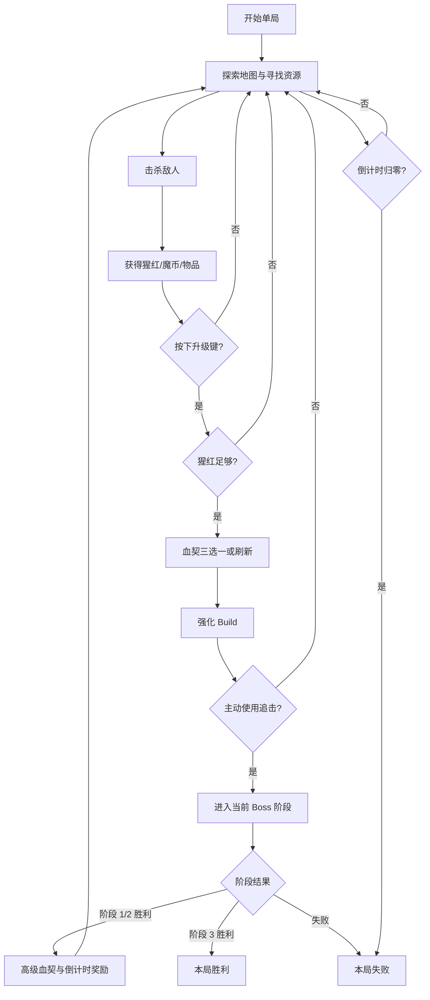
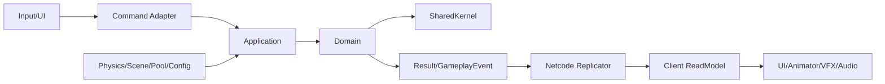

# 《血族狂猎》项目总计划

> 状态：架构基线已确认，M1 纵向切片实施中  
> 更新日期：2026-08-23  
> 当前工程：`MultiplayerThirdPersonTemplate`  
> 原始玩法资料：`C:\Users\shenc\Downloads\暂定.pdf`

## 1. 文档目的

本文档保存《血族狂猎》从玩法需求到 Unity/NGO 落地的完整项目计划，作为后续架构、编码、资源制作、测试和验收的共同基线。

本文档明确区分：

- **策划要求**：来自当前玩法资料，实施时必须覆盖。
- **已确认架构原则**：后续代码必须遵守。
- **推荐默认决策**：为避免开发停滞而采用的建议，可在正式制作前调整。
- **待确认事项**：策划仍未完全定义，不能静默写死在代码中。

## 2. 游戏目标与范围

### 2.1 游戏定位

- 类型：1～4 人合作动作 Roguelike / 类吸血鬼幸存者。
- 核心压力：单局全局倒计时不断减少。
- 核心成长：击杀敌人获取猩红资源，通过三选一血契形成局内 Build。
- 核心目标：玩家主动选择时机追击并挑战 Boss，通过三个阶段延长倒计时并最终击败 Boss。
- 地图主题：中世纪教堂与废墟风格的环形区域。

### 2.2 单局目标

- 标准单局目标时长约 25 分钟。
- 单局预计获得 12～15 张血契。
- 玩家可以持续刷怪积累战力，但不能无限拖延，因为倒计时持续流逝。
- Boss 不强制在固定时间触发，玩家主动使用追击能力进入阶段战。
- Boss 共三个阶段；第一、第二阶段成功后返回主循环，第三阶段胜利后结束本局。

### 2.3 终止条件

- 单人玩家死亡：本局失败。
- 多人全队失去作战能力：本局失败。
- 全局倒计时归零：本局失败。
- Boss 阶段挑战失败：按 Boss 阶段规则判定失败。
- 第三阶段 Boss 被击败：本局胜利。

## 3. 核心循环



## 4. 架构总原则

### 4.1 目标架构

采用：

- 功能模块化单体。
- 轻量六边形/整洁架构边界。
- NGO Client-Server/Host Authority。
- 服务端权威模拟。
- ScriptableObject 数据配置。
- 事件驱动表现。
- 渐进复用当前官方模板，不进行一次性全项目重写。

### 4.2 逻辑与表现分离

Domain/Application 禁止引用：

- `UnityEngine.UI`、UI Toolkit 具体控件。
- Animator、AnimationEvent。
- VFX、ParticleSystem。
- AudioSource、音频播放服务。
- Camera、Cinemachine。
- NGO 的 `NetworkBehaviour`、`NetworkVariable`、RPC。
- 具体 Presenter、View、HUD。

表现层只能消费：

- `Result`。
- `GameplayEvent`。
- `ReadModel`。

表现层不得直接修改生命、属性、猩红、血契、奖励、Boss 阶段或 `NetworkVariable`。

### 4.3 依赖方向



跨功能模块只能通过 `Contracts` 或 `Infrastructure.Integration` 的小接口通信，禁止 Player、Enemy、Boss、Progression 互相引用具体实现。

## 5. 当前官方模板复用策略

| 模板能力 | 处理方案 |
| --- | --- |
| Multiplayer Session、Relay、加入码、4 人房间 | 直接复用会话和 UI 外壳 |
| CoreInputHandler、CoreMovement、Cinemachine | 作为玩家输入/运动/相机外壳，增加服务端校验 |
| ScriptableObject GameEvent | 只用于客户端本地 UI、动画、VFX、音频广播 |
| StatsConfig、StatDefinition | 复用不可变配置思路，运行时属性模型重构 |
| ModularInteractable | 作为拾取物、商店、祭坛的 Unity/网络适配器 |
| Shooter 弹丸、弹道、对象池 | 抽成中立 Projectile 模块，供远程怪和 Boss 使用 |
| UI Toolkit、CoreHUD | 复用 UI 技术栈，改为消费 ReadModel |
| CoreDirector | 留在 Presentation 层负责音频/VFX/镜头反馈 |
| GameManager | 只保留连接、场景和旧模板外壳，不继续放入玩法规则 |

### 5.1 必须修正的模板约束

- `CoreStatsHandler` 的运行时 `NetworkList` 已迁移为 Server 写入；Owner 的体力消费等操作通过 RPC 请求，仍只作为迁移期属性外壳。
- 当前 `ShooterHitProcessor` 混合伤害、Animator、镜头震动、伤害数字，正式实现必须拆分。
- 当前 NetworkManager 拓扑和 Session 网络类型必须在 M0 阶段统一确认。
- `GameEvent<T>.LastValue` 不是权威状态，也不承担网络同步。

## 6. 目标目录与程序集

```text
Assets/VampireHunt/Scripts/
  SharedKernel/
  Contracts/
  Run/
  Player/
  Combat/
  Effects/
  Progression/
  Enemies/
  Boss/
  Navigation/
  Spawning/
  Economy/
  World/
  Artifacts/
  Infrastructure/
    Unity/
    Netcode/
    Integration/
  Presentation/
  Bootstrap/
  Tests/
```

建议程序集：

```text
VampireHunt.SharedKernel
VampireHunt.Contracts
VampireHunt.Run
VampireHunt.Combat
VampireHunt.Effects
VampireHunt.Player
VampireHunt.Progression
VampireHunt.AI
VampireHunt.World
VampireHunt.Economy
VampireHunt.Infrastructure.Netcode
VampireHunt.Presentation
VampireHunt.Bootstrap
```

程序集引入顺序：先定义 Contracts 与接口，再实现逻辑和适配层，最后建立 asmdef 边界，避免先拆程序集造成循环依赖。

## 7. SharedKernel 与 Contracts

### 7.1 SharedKernel

核心类型：

- `EntityId`：稳定、单调、不复用的实体标识。
- `PlayerId`、`RunId`、`PactId`、`AbilityId`、`StatusId`。
- `ServerTick`、`ServerTimestamp`。
- `Result<T>`、`FailureReason`。
- `DeterministicRandom`。
- `ValueRange`、`Percentage` 等值对象。

### 7.2 Contracts

只放跨模块的稳定协议：

- Command。
- Result。
- GameplayEvent。
- ReadModel Snapshot。
- 小型能力接口。

推荐能力接口：

- `IDamageReceiver`。
- `IHealingReceiver`。
- `IAttributeModifierTarget`。
- `IAbilityGrantTarget`。
- `IStatusEffectTarget`。
- `IRewardService`。
- `IRunClockModifierTarget`。
- `ICombatTargetQuery`。
- `IEntityCapabilityCatalog`。

## 8. Run 模块：单局流程与倒计时

### 8.1 核心类型

- `RunAggregate`。
- `RunClock`。
- `RunPhase`。
- `RunRules`。
- `RunApplicationService`。
- `RunStateReplicator`。
- `RunHUDReadModel`。

### 8.2 状态

```text
Lobby
Exploring
BossEncounter
BossPhaseTransition
Victory
Defeat
```

Boss 阶段编号由 Boss 模块管理，Run 只关心是否正在遭遇以及最终结果。

### 8.3 倒计时实现

- 服务端保存 `endServerTime`，客户端按服务器时间计算显示值。
- 不按帧同步剩余秒数。
- 所有延时通过 `ExtendClockCommand` 进入 Application。
- Boss 狂暴通过 `DrainRateModifier` 改变消耗速率，不直接重复减秒。
- Boss 阶段另设 `EncounterDeadline`，不与全局倒计时共用一个变量。
- Solo 暂停由 `SelectionTimePolicy` 冻结模拟和时钟。

### 8.4 每 Tick 结算顺序

```text
接收并验证 Command
→ 移动与 AI
→ 战斗结算
→ 掉落、奖励、时间增减
→ Boss 阶段推进
→ 胜负判定
→ 生成状态快照和瞬时事件
```

推荐规则：最终阶段 Boss 在同一 Tick 被击杀时，胜利优先于倒计时归零。

## 9. Player 模块

### 9.1 核心类型

- `PlayerAggregate`。
- `PlayerVitals`。
- `PlayerAttributes`。
- `PlayerCommandService`。
- `PlayerStateMachine`。
- `PlayerStateReplicator`。
- `PlayerPresenter`。

### 9.2 玩家状态

```text
Normal
Attacking
Charging
Dashing
HitReact
Crimson
Pursuit
Dead
Spectating
```

### 9.3 命名约束

策划中的两个“猩红”必须拆名：

- `ScarletResource`：杀怪获得、用于触发血契构筑的资源。
- `CrimsonState`：低血量或低倒计时时进入的特殊战斗状态。

### 9.4 基础属性

初始策划字段：

- MaxHealth。
- MaxStamina。
- DashStaminaCost。
- StaminaRecoveryRate。
- Damage。
- WeaponRange。
- Cooldown。
- KnockbackForce。
- MoveSpeed。

基础值由 ScriptableObject/表格配置，运行时数值由 `PlayerAttributes` 和修饰器计算。

### 9.5 移动与冲刺

- 保留 `CoreMovement` 作为 Unity 运动外壳。
- 客户端立即预测移动和冲刺表现。
- 服务端验证速度、位移、体力、状态与时间戳。
- 冲刺属于 Ability，不直接写在 Input Handler 中。

## 10. Combat 模块

### 10.1 核心类型

- `AttackDefinition`。
- `ComboGraph`。
- `AttackIntent`。
- `AttackRuntimeState`。
- `ChargeTracker`。
- `CombatResolver`。
- `DamageRequest`。
- `ResolvedDamage`。
- `DamageResult`。
- `StatusEffectCollection`：只负责状态生命周期、叠层和到期移除。
- `EffectRuntimeHost`：统一安装、更新、Tick 和卸载模块化效果。
- `IHitQuery`。

### 10.2 连招

- 左键、右键及其衔接使用数据化 `ComboGraph`。
- 每段配置前摇、命中窗、后摇、衔接窗、体力消耗、伤害倍率、击退和受击规则。
- 最大四段不写死在 Animator StateMachineBehaviour。
- Animator 只表现当前 `AttackId` 和阶段。
- 普通连招受到强受击反应后中断。

### 10.3 蓄力攻击

- 按住时间由服务端 Tick 计算。
- 释放时映射为 1～3 档蓄力。
- 客户端可以预测蓄力视觉，但不能提交最终倍率。

### 10.4 服务端伤害链路

```text
AttackIntent
→ CombatResolver 验证
→ IHitQuery 执行服务端命中查询
→ DamageRequest
→ ResolvedDamage
→ DamageResult
→ DamageConfirmedEvent
→ 客户端 Presenter
```

客户端只提交：

- 输入类型。
- 朝向/目标方向。
- 客户端 Tick。
- 连招意图。

客户端不提交：

- 最终伤害。
- 暴击结论。
- 目标最终生命。
- 掉落结果。

### 10.5 当前 M1 的已确认原型例外

为优先验证联机战斗手感，当前纵向切片采用“信任客户端命中结果”：

- 拥有玩家对象的客户端计算剑气伤害、暴击和命中。
- 客户端通过拥有者受限 RPC 请求服务器生成剑气，并向怪物提交命中结果。
- 服务器仍是怪物生命、玩家生命、怪物 AI、猩红奖励、生成和销毁的唯一写入端。
- 当前不实现距离、攻击阶段、冷却、伤害值或命中体反作弊验证。
- `DamageRequest`、`IDamageModifier`、`ICombatOutcomeListener` 与 Effects 端口保留未来切换到完整服务端验证及接入血契的边界。

本节仅覆盖当前原型，明确覆盖 10.3、10.4 中关于“客户端不提交最终伤害/暴击”的正式发行目标；需要反作弊时再恢复完整服务端结算链路。

## 11. 属性与修饰器

### 11.1 分层

- `StatsConfig`：不可变基础配置。
- `PlayerVitals`：Health、Stamina 等当前资源值。
- `PlayerAttributes`：Damage、Range、Speed 等派生属性。
- `StatModifierCollection`：局内修饰器集合。

### 11.2 修饰器模型

```text
StatModifier
  SourceId
  StatId
  Operation
  Value
  StackCount
  Lifetime
```

操作类型：

- Flat。
- AdditivePercent。
- Multiplicative。

统一公式：

```text
FinalValue = (BaseValue + SumFlat)
           × (1 + SumAdditivePercent)
           × ProductMultiplicative
```

最大生命变化必须配置策略：

- 保持当前百分比。
- 保持当前绝对值。
- 增加容量时恢复增加部分，容量降低时只钳制。

运行时资源容量已经直接进入 `RuntimeStat.MaxValue` 并由 Server 随 `CurrentValue` 一起同步。`CoreStatsHandler` 的伤害/治疗钳制、自动回复、`GetMaxValue` 和 `StatChangePayload.maxValue` 均读取运行时上限，不再读取静态定义作为最终上限。

### 11.3 与 CoreStatsHandler 的关系

血契不能由 `CoreStatsHandler` 保存或解释，但数值型血契可以通过 `IAttributeModifierTarget` 影响最终属性。

职责划分：

- `PactInventory` 保存获得的血契和层数。
- `GameplayEffectHost` 是玩家唯一效果宿主，按来源增量安装、更新和解除血契/状态模块。
- `EffectRuntimeHost` 解释纯模块描述，血契领域本身不引用模板属性实现。
- `AttributeModifierCollection` 按属性 ID 保存可注册、可卸载的数值修饰。
- `PlayerAttributeHost` 实现 `IAttributeModifierTarget`，以 `CoreStatsHandler` 当前值作为基础值并提供最终属性查询。
- `PlayerResourceCapacityHost` 实现 `IResourceCapacityModifierTarget`，只在 Server 重算 Health/Stamina 容量并原子迁移当前值。
- `PlayerVitals` 保存生命和体力当前值。
- `CoreStatsHandler` 在迁移期只作为旧模板适配外壳，最终不成为血契权威源。

当前 Client-Server 迁移约束：

- 运行时 Stat 列表只允许 Server 写入。
- Owner 的跳跃、冲刺、交互消费先本地预测是否可执行，再请求 Server 复核并扣除。
- 生命伤害、怪物击杀猩红与服务端回复由 Server 直接写入。
- 血契不直接调用 `CoreStatsHandler`；仍通过 Combat/Progression 的 modifier port 接入。

## 12. Progression：血契与 Build

### 12.1 核心类型

- `PactDefinition`。
- `PactCatalog`。
- `PactInventory`。
- `PactRollService`。
- `PactDraft`。
- `PactDraftNetworkBridge`。
- `LuckPolicy`。
- `RerollPricingPolicy`。
- `EffectDefinition`。
- `IEffectModuleDescriptor`。
- `EffectRuntimeHost`。
- `GameplayEffectHost`。

### 12.2 PactDefinition 字段

- 稳定 `PactId`。
- DisplayName、Description、IconId。
- Tier：Normal、Advanced、Ultimate。
- Rarity。
- BaseWeight。
- Tags。
- Prerequisites。
- Exclusions。
- Repeatable。
- MaxStacks。
- EffectModules：引用独立的 `EffectModuleAsset`，每个模块只描述一种行为。

### 12.3 抽取与选择

```text
玩家按下 TriggerLevelup
→ Owner InputHandler 广播本地升级事件
→ 服务端校验本次升级所需猩红并创建 Draft
→ 过滤前置/互斥/满层血契
→ Luck 调整权重
→ 使用单局 Seed 生成三个唯一选项
→ 客户端选择或支付魔币刷新
→ 服务端重新验证
→ PactInventory.AddOrStack
→ PactNetworkState 同步层数
→ GameplayEffectHost.SetSource 增量更新对应 EffectSource
```

升级费用由服务端持有，以 100 猩红为基础值；每次成功选择血契后，下一次费用按默认 10% 复合增长并向上取整。Draft 创建时冻结本次费用，刷新预付与最终扣款均以该冻结值计算。

### 12.4 模块化效果核心

- `EffectSourceKey` 使用 `SourceKind + DefinitionId + InstanceId` 唯一标识来源。
- `EffectDefinition` 只保存强类型模块描述，不包含运行时状态。
- `EffectModuleRegistry` 用 `ModuleTypeId` 创建运行时模块。
- `EffectRuntimeHost` 对同一来源执行 `Install / Update / Tick / Dispose`，叠层变化不重复安装。
- `EffectExecutionRealm` 明确 `Server / Owner / Presentation`，不同模块只在指定执行域运行。
- `EffectPortCollection` 暴露小型能力契约，模块不查找或依赖具体血契、玩家、敌人类。

首批模块：

- `AbilityPlanModifier`：伤害、弹量、散射、穿透、射程和冷却修改。
- `ApplyStatusOnHit`：命中时附加状态。
- `PeriodicDamage`：服务端周期伤害。
- `ActionBlock`：行动/移动阻断。
- `StatusThreshold`：叠层阈值转换状态。
- `PresentationCue`：向表现层提供稳定 CueId，不直接创建 VFX。
- `AttributeModifier`：通过 `IAttributeModifierTarget` 修改玩家派生属性，支持 Flat、AdditivePercent 和 Multiplicative。
- `ResourceCapacityModifier`：通过 `IResourceCapacityModifierTarget` 修改 Health/Stamina 运行时上限，支持 PreserveRatio、PreserveCurrent 和 GrantIncreaseOnly。

属性模块统一使用：

```text
FinalValue = (BaseValue + SumFlat)
           × (1 + SumAdditivePercent)
           × Product(1 + Multiplicative)
```

模块通过 `StatDefinition` 资产选择属性，`constantValue` 每个来源应用一次，`valuePerStack` 随血契层数变化。伤害、治疗、体力消费等资源变化仍走服务端权威命令，不能当作永久属性修饰写入。

### 12.5 血契层级

- 普通血契：基础属性和早期构筑。
- 高级血契：改变流派机制和状态反应。
- 终极血契：改变能力本质或解锁决定性机制。

### 12.6 副契

副契不进入玩家 `PactInventory`，独立建模为：

- `EnemyAffixDefinition`。
- `EnemyAffixSet`。
- `EnemyAffixDefinition` 内的模块化 `EffectDefinition`。

它用于强化敌人、加入代价或改变敌人行为，避免和玩家增益模型混淆。

当前实现采用本局共享的 `EnemyAffixRunState`：每次手动升级同时生成三项血契与三项副契，玩家分别选中一项后统一确认。服务器在确认时一次性提交玩家血契和本局副契；`EnemySpawnDirector` 只在敌人出生前捕获副契快照，因此新获得的副契只影响之后生成的敌人，不回溯修改场上存活敌人。每个敌人保存自身实际应用的副契 ID/层数，并以实例级 `EnemyRuntimeStats` 解析生命、移动、攻击与奖励数值。

### 12.7 状态与元素扩展

状态定义不再使用行为枚举或硬编码分支。`StatusEffectCollection` 只保存生命周期，具体行为全部由效果模块组合。为后续火焰、流血、冰冻、领域、吸血、狂暴、猩红等状态预留：

- `StatusEffectCatalogAsset`。
- `StatusEffectDefinition` + `EffectModuleAsset[]`。
- `ElementReactionDefinition`。
- `ElementReactionResolver`：从目录读取反应规则，不硬编码燃烧/冻结 ID。

血契引用稳定 `StatusId`，不要把 burn/freeze/bleed 字符串散落在配置与代码中。

## 13. Enemies 模块

### 13.1 类型

- 近战小怪。
- 远程小怪。
- 精英近战怪。

### 13.2 核心类型

- `EnemyAggregate`。
- `EnemyArchetypeDefinition`。
- `EnemyBrain`。
- `EnemyApplicationService`。
- `EnemyStateReplicator`。
- `EnemyPresenter`。

### 13.3 状态机

```text
Spawning
→ Seeking
→ Approaching / Orbiting
→ Telegraphing
→ Attacking
→ Recovering
→ Dead
```

### 13.4 类型差异

- 近战：沿导航场接近玩家并执行短距离攻击。
- 远程：进入配置距离后环绕，避免持续贴近，周期发射弹丸。
- 精英：更强生命、抗击退、蓄力前摇、额外猩红与掉落权重。

领域状态重置和表现重置必须分开：对象池回收时先清理 Aggregate，再清理 Animator/VFX/Audio。

## 14. Spawning 模块

### 14.1 核心类型

- `SpawnDirector`。
- `SpawnBudget`。
- `SpawnRuleSet`。
- `SpawnCandidateEvaluator`。
- `SpawnVisibilityQuery`。
- `EnemyPoolPort`。

### 14.2 规则

- 只有服务端决定刷怪。
- 使用软上限和预算，不让每个怪物自行刷新。
- 刷新中心主要跟随游走状态的 Boss。
- 使用环形候选点。
- 检查地面、阻挡、玩家距离、玩家朝向和视线。
- 不依赖某一客户端 Camera 进行权威判定。
- 多人时优先选择对所有玩家都不可见或低可见的候选点。
- 越靠近 Boss，允许更高刷怪预算；远处降低刷新率。

## 15. Navigation 模块

### 15.1 目标

支撑大量小怪共享寻路，避免每个敌人独立运行昂贵路径搜索。

### 15.2 核心类型

- `FlowFieldWorld`。
- `FlowFieldSolver`。
- `NavigationField`。
- `NavigationFieldRequest`。
- `ObstacleRevision`。
- `EnemyNavigationAgent`。
- `INavigationField`。

### 15.3 更新策略

- 服务器计算导航场。
- AI 分批在 10～20Hz 更新，不强制跟随 50Hz 网络 Tick。
- 玩家目标单元变化或障碍版本变化时重算。
- 地图塌陷只更新 `ObstacleRevision`。
- 客户端只接收敌人位置/方向并插值，不同步完整 Flow Field。

## 16. Boss 模块

### 16.1 核心类型

- `BossAggregate`。
- `BossProgress`。
- `BossEncounterService`。
- `BossPhaseDefinition`。
- `BossAttackScheduler`。
- `BossAttackDefinition`。
- `BossStateReplicator`。
- `BossPresenter`。

### 16.2 状态机

```text
Roaming
→ Pursuit
→ Encounter
→ PhaseTransition
→ Retreat / Roaming
→ Dead
```

### 16.3 阶段推进

阶段 1/2 胜利：

- 结算阶段奖励。
- 掉落高级血契。
- 延长全局倒计时。
- 进入下阶段配置。
- Boss 返回游走状态。

阶段 3 胜利：

- 掉落终极血契或结算最终奖励。
- Boss 进入 Dead。
- Run 进入 Victory。

### 16.4 Boss Ability

- `SweepingSlashAbility`：横扫。
- `RadialVolleyAbility`：旋转弹幕。
- `GridCutAbility`：网格切割。
- `ShockwaveAbility`：震阵/危险区。
- `ChargeAbility`：蓄力斩击。
- `LaserSweepAbility`：激光扫射。
- `FrenzyClockDrainAbility`：低血量时加速全局倒计时。

Ability 生命周期：

```text
CanStart
→ Telegraph
→ Resolve
→ Recover
```

服务端同步 `AttackId + StartTick + Parameters`，客户端按同一时间轴播放预警，不逐帧同步所有预警图形。

### 16.5 Ability 数据资产落地（当前实现）

Boss 技能采用“定义、逻辑、表现、阶段装配”四部分组合：

- `BossAbilityAsset`：一个可右键创建的技能数据表，保存唯一 ID、权重、CD、距离/血量条件、Telegraph/Resolve/Recover 时长、逻辑资产和表现 Cue。
- `IBossAbilityLogicRuntime` 实现脚本：技能规则的可替换入口；具体横扫、弹幕、网格等逻辑分别写在 `Scripts/Boss/Abilities/Logic` 下的独立 `.cs` 文件中。`BossAbilityAsset` 的 Logic 字段直接引用脚本，Data 目录不存放逻辑资产。
- `BossAbilityPresentationCue`：按施法时间轴配置动画 Trigger、VFX、音效，以及胸口、头部、左右手、脚底等 Boss 相对挂点。
- `BossPhaseAsset` / `BossPhaseSetAsset`：配置某阶段可使用哪些技能、权重、初始 CD 和次数限制；Boss 预制体只挂一个阶段集合。

目录约束：`Data/Boss` 只存技能、阶段等配置资产；行为代码放在 `Scripts/Boss/Abilities/Logic`；材质等客户端表现资源放在 `Presentation/Boss`；VFX 对象放在 `Prefabs/Boss`。

运行时分层：

```text
BossAbilityPhaseProvider（阶段配置的唯一引用点）
+ BossAbilityContextProvider（目标、距离、血量输入采样）
→ BossAbilityHost（只持有纯 C# 生命周期与调度）
→ BossAbilityServerDriver（仅服务端推进与确定性随机种子）
→ BossAbilityStateReplicator（只复制紧凑时间轴）
→ BossAbilityPresenter（把时间轴分发成表现 Cue）
→ BossAbilityAnimatorPresenter / BossAbilityVfxPresenter / BossAbilityAudioPresenter
```

Boss 预制体采用与 Player 相同的组件组合原则，但不照搬 Player 的技能组件膨胀：每个宿主组件只负责一种系统职责，具体技能仍由阶段数据资产装配，技能规则脚本不会逐个作为 MonoBehaviour 堆到 Boss 身上。表现 Cue 的时间调度、动画、VFX 与音频分别由独立组件消费；任何表现组件都不能反向修改技能、阶段或网络状态。

当前已完成技能系统骨架、多人状态复制、Boss 相对表现挂点和演示技能 `Demo Blood Pulse`。演示技能直接引用 `Scripts/Boss/Abilities/Logic/BossNoOpAbilityLogic.cs`，该脚本只验证装配、时间轴和表现链路；横扫、弹幕、网格、轰炸、斩击、激光、狂暴等正式伤害/判定逻辑仍属于后续内容实现。

### 16.6 Ability Gameplay Services（当前实现）

技能规则不直接调用 Unity 物理、NGO、玩家组件或场景 `GameManager`。跨模块端口定义在 `Scripts/Contracts/BossAbilityServiceContracts.cs`，Unity/联机适配器放在 `Scripts/Infrastructure/Integration/Boss/Services`，由 Boss 预制体上的原子组件提供：

```text
BossAbilityServiceHost（只组装，不执行玩法）
├─ BossPlayerTargetQuery      → 联机存活玩家查询
├─ BossPhysicsHitQuery        → Sphere / Box 空间判定
├─ BossDamageService          → IDamageReceiver 权威伤害入口
├─ BossProjectileSpawner      → 服务端 NetworkObject 弹道生成
├─ BossStatusEffectService    → IStatusEffectTarget 权威状态入口
├─ BossRunClockModifier       → VampireHuntGameManager 倒计时入口
└─ BossBodyStateHost          → 血量、踉跄、左右手状态网络读模型
```

`BossAbilityHost` 在初始化时取得一个不可变 `BossAbilityServices` 并交给纯 C# Controller；只有实现 `IBossAbilityServiceConsumer` 的技能逻辑会收到该集合，而且保证在 `OnCastStarted` 之前注入。它不是全局单例，也不允许技能自己通过 `FindObjectOfType` 寻找依赖。

多人规则：所有查询、伤害、状态、弹道和倒计时写入只在服务器成功；客户端仅消费 `BossAbilityStateReplicator` 的技能时间轴和 `BossBodyStateHost` 的身体读模型。Projectile 配置表初始为空，正式弹幕预制体制作完成后再以 `ProjectileId` 注册，同时加入 NetworkManager 的 Network Prefabs。

## 17. Projectile 模块

从 Shooter 模板抽取：

- 直线弹丸。
- 弧线弹丸。
- 爆炸效果。
- 对象池。
- 命中表现。

目标接口：

- `IProjectileMovement`。
- `IProjectileImpactResolver`。
- `IProjectilePool`。
- `ProjectileDefinition`。

伤害仍由 Combat 模块结算，Projectile 不直接修改 Stats。

## 18. Economy、Loot 与 Inventory

### 18.1 核心类型

- `LootTable`。
- `RewardService`。
- `ScarletLedger`。
- `CurrencyWallet`。
- `Inventory`。
- `ConsumableService`。
- `EquipmentService`。
- `ShopInventory`。
- `ShopTransactionService`。

### 18.2 掉落

- 普通怪：猩红、概率物品、魔币。
- 远程怪：可配置不同掉落权重。
- 精英怪：更多猩红、更高物品/魔币概率。
- Boss 阶段：高级血契、物品、魔币、倒计时恢复。

### 18.3 多人分配默认策略

- 血契 Build 和背包按玩家独立。
- 合格队员获得个人猩红份额，避免抢尾刀。
- Boss 阶段奖励面向团队结算，但血契选项逐玩家合法生成。
- 拾取和购买必须由服务端做原子校验，防止双重领取。

### 18.4 道具

- 血药：恢复生命。
- 体力兴奋剂：提高体力上限与恢复速度。
- 残缺命运星盘：满足条件后提供强制血契抽取，使用有生命代价。

### 18.5 饰品

- 背包：增加消耗品容量。
- 血狼牙：提高攻击伤害并附带受击视觉。
- 赫尔墨斯之靴：提高移速并附带移动视觉。

### 18.6 当前背包实现（2026-08-24）

- `UsableItemInventory` 使用固定槽位；默认玩家容量为 4，按定义的单槽上限自动堆叠，空间不足时整笔添加失败。
- 可使用道具分为成功使用后消耗与使用后保留两类；保留型道具固定为单槽单件。
- `AccessoryInventory` 不限制饰品种类总数，仅按饰品定义执行唯一、有限或无限堆叠规则。
- `PlayerInventoryNetworkState` 由服务端修改库存：可使用道具槽仅向所属玩家同步，饰品向观察者同步并以 `Equipment` 来源安装到 `GameplayEffectHost`。
- `ItemCatalogAsset` 是稳定 `ItemId` 的统一入口；拾取、奖励及后续商店只能通过 `IPlayerItemInventory` 提交库存变更。
- `UseItem1`～`UseItem4` 将键盘 1～4 或手柄十字键转换为本地槽位事件；`PlayerItemUseNetworkBridge` 再由 Owner 向 Server 请求执行。
- `ConsumableService` 在服务端校验槽位、动作阻断、按 ItemId 计算冷却，并且只在至少一个效果成功后消耗道具。
- `UsableItemDefinitionAsset.useEffects` 可组合配置 `UsableItemEffectAsset`；当前内置修改 Stat 与施加 Status 两种效果执行器。
- 现有 `HP Bottle.asset` 已配置 `RestoreHealth35`，作为 ItemId 1 的可运行示例；物品仍需由掉落、奖励或调试入口发放给玩家。
- 玩家 HUD 右下角固定展示 4 个可使用道具槽，监听 Owner-only `UsableItemsChanged` 更新名称、Asset 图标、数量和键盘 1～4 提示；使用结果继续通过 `ItemUsePresentationEvent` 提供给音效和 VFX Presenter。

### 18.7 当前商店实现（2026-08-24）

- `ShopDefinitionAsset` 配置商店商品池、一次出现数量和魔币刷新价格；`ShopProductDefinitionAsset` 将商品价格、数量和权重与道具自身定义分离。
- 每个玩家按 `RunSeed + ShopInstanceId + PlayerId + RefreshCount` 在本地维护独立 `ShopSession`；关闭后重开保留本人的商品和售罄状态，不向队友同步。
- 客户端商品 Roll 结果可信；购买只提交稳定 `ProductId`，服务端仍从共享 `ShopCatalogAsset` 解析道具、数量和价格。
- `ShopTransactionService` 先预检背包，再原子扣除 `Coin` 并通过 `IPlayerItemInventory` 发放；提交异常会退回魔币，交易 ID 用于避免重复请求。
- 刷新商品需要服务端成功扣除配置的魔币费用，随后客户端才生成下一组三个商品；魔币不足时保留当前商品。
- `OpenShopInteractionEffect` 让 `ModularInteractable` 只负责打开商店；`PlayerShopNetworkBridge` 负责交易 RPC，`ShopPresenter` 消费本地会话并复用玩家 HUD 的 UI Toolkit 文档。
- `SpiritShop.prefab` 是当前可放入场景或由服务端生成的示例，商品池使用已有血瓶的四种数量/价格组合。

### 18.8 当前共享世界掉落实现（2026-08-24）

- 每个 `EnemyArchetypeAsset` 独立引用一个 `LootTableAsset`；掉落表可同时配置必定掉落、加权抽取次数、空掉落权重以及每项数量范围。
- `LootRollService` 使用 `RunSeed + LootTable StableId + EnemyEntityId` 在纯 C# 中确定性计算结果，不依赖客户端或 Unity 全局随机状态。
- `EnemyLootDropper` 只在服务端确认敌人死亡后提交一次 Roll，并在敌人销毁前生成已注册的 `NetworkObject` 拾取物。
- 掉落物属于共享世界，首个通过服务端背包校验的玩家获得；背包拒绝整笔物品时拾取物保留，成功后由 `GrantItemInteractionEffect` 请求销毁。
- `NetworkPickupLifetime` 负责服务端超时清理。当前 `HPBottlePickup.prefab` 的存活时间为 45 秒。
- `VH_MeleeEnemyLoot.asset` 是首个配置；当前由 Asset 配置普通近战敌人的必定 Coin 掉落，以及 99 空权重、1 血瓶权重的一次额外抽取。
- `LootPickupDefinitionAsset.spawnMode` 区分两种生成语义：`PreparedItemGrant` 生成一个道具拾取物并向 `GrantItemInteractionEffect` 写入数量；`PrefabOnly` 按数量生成多个 prefab，不检查或配置拾取组件，交互和销毁完全由 prefab 自身负责。Coin 使用后者。

## 19. World 模块

### 19.1 地图结构

- CoreRing。
- MiddleRing。
- OuterRing。

使用预制地图块、固定 Socket、随机模块选择，不在第一版进行完全程序化几何生成。

### 19.2 核心类型

- `WorldLayoutDefinition`。
- `WorldLayoutSeed`。
- `MapChunkDefinition`。
- `PoiSocket`。
- `PoiSpawnRule`。
- `WorldPhaseService`。

### 19.3 模块化地点

- 商店之英灵：随机三个商品。
- 教堂废墟：刷新消耗品。
- 血魔晶：精英守卫与猩红奖励。
- 战争铁匠之英灵：后续武器强化。
- 猎魔人之英灵：后续猩红购买。

### 19.4 Boss 阶段环境变化

- 阶段一：半废墟状态。
- 阶段二：场地塌陷，更新碰撞与导航障碍。
- 阶段三：血雨、光照变化、环境危险。

网络只同步：

- World Seed。
- 选中的模块 ID。
- POI 状态。
- World Phase。

不网络同步完整几何数据。

## 20. Artifacts 模块

### 20.1 核心类型

- `ArtifactDefinition`。
- `ArtifactInventory`。
- `IArtifactAbility`。
- `SelectionTimePolicy`。

### 20.2 默认策略

- 单人“时空沙漏”：血契选择期间暂停服务端模拟与倒计时。
- 多人首版不允许单人全局暂停，血契选择可以延后处理。
- 多人“时空共鸣之器”只预留接口，待玩法明确后实现。
- 如未来支持多人暂停，必须使用全队投票和超时。

## 21. UI 与 Presentation

### 21.1 ReadModel

- `RunHUDReadModel`。
- `PlayerHUDReadModel`。
- `BossHUDReadModel`。
- `PactDraftReadModel`。
- `InventoryReadModel`。
- `ShopReadModel`。
- `SpectatorReadModel`。

### 21.2 HUD

- 玩家生命条。
- 玩家体力条。
- 全局倒计时。
- 猩红资源槽。
- Boss 血量。
- Boss 三阶段格。
- 当前血契和层数。
- 状态效果图标。
- Boss 技能预警。
- 拾取、伤害、奖励和倒计时变化提示。

### 21.3 事件使用规则

ScriptableObject GameEvent 只负责本地表现扇出：

- UI 更新提示。
- Animator Trigger 请求。
- VFX/Audio 请求。
- Camera Shake 请求。

权威状态来自 Replicator/ReadModel，而不是 `GameEvent<T>.LastValue`。

## 22. Networking

### 22.1 推荐拓扑

- 1～4 人。
- Client-Server/Host Authority。
- Relay 网络。
- 首版不允许中途加入。
- 断线重连预留接口，后续实现。

### 22.2 服务端权威内容

- RunClock 与胜负。
- Boss、敌人和刷怪。
- 血量、体力、状态和伤害。
- 猩红、魔币、背包和装备。
- 血契 Roll、选择、刷新和效果。
- 掉落、拾取和商店交易。
- 地图 Seed、POI 和阶段变化。

### 22.3 玩家权威边界

- 客户端采集输入。
- 客户端预测移动、动画和纯表现。
- 服务端验证速度、位置、时间戳、体力和状态。
- 客户端不能决定命中、伤害、暴击、奖励或血契结果。

### 22.4 三类网络通道

| 通道 | 示例 | NGO 机制 |
| --- | --- | --- |
| 持久状态 | 血量、Boss 阶段、货币、倒计时终点 | NetworkVariable/NetworkList |
| 瞬时事件 | 命中、技能预警、奖励、血契确认 | RPC/Event Replicator |
| UI 状态 | 格式化倒计时、卡牌文本、进度条 | 本地 ReadModel |

## 23. Bootstrap 与组合根

`RunCompositionRoot` 负责：

- 加载并验证配置。
- 创建 Domain/Application 服务。
- 构造 Physics、Pooling、Netcode、Persistence 适配器。
- 注册跨模块 Integration Adapter。
- 建立 Replicator 和 ReadModel Sink。
- 管理场景进入与单局清理。

不得使用全局 Service Locator 让任意模块获取任意服务。

## 24. 配置与内容管线

### 24.1 ScriptableObject 规则

ScriptableObject 只保存：

- 基础数值。
- 血契定义。
- 敌人/Boss 配置。
- 掉落表。
- 世界布局定义。
- UI 文案和资源引用。

禁止保存：

- 当前生命。
- 当前血契层数。
- 当前 Boss 阶段。
- 当前倒计时。
- 网络对象引用。
- 玩家背包运行时状态。

### 24.2 稳定 ID

- 网络和存档使用稳定 ID，不传 ScriptableObject 实例。
- ID 不依赖文件名、显示名或 `Animator.StringToHash`。
- 内容重命名不得改变稳定 ID。

### 24.3 内容验证器

Editor 验证：

- ID 唯一。
- 血契前置/互斥存在。
- Tier 与 Effect 类型合法。
- 可重复血契有合理 MaxStacks。
- LootTable 权重有效。
- Boss 阶段引用完整。
- Ability 的 Telegraph/Resolve/Recover 时间有效。
- NetworkPrefab 和对象池配置完整。

## 25. Save 与局外成长

局外成长未定稿，先建立：

- `ProfileSaveData`。
- `UnlockCatalog`。
- `MetaCurrencyWallet`。
- `RunResult`。
- `SaveVersion`。
- `SaveMigration`。

首版保存：

- 用户设置。
- 已解锁神器/血契。
- 局外货币。
- 图鉴。
- 历史统计。

首版不实现完整的多人局内断点存档。

## 26. 测试策略

### 26.1 Domain/EditMode

- RunClock 延时、加速、暂停和归零。
- 同 Tick Boss 击杀与倒计时归零判定。
- ComboGraph 输入分支和中断。
- 蓄力档位计算。
- DamagePipeline 计算顺序。
- StatModifier 叠加和移除。
- PactRoll 权重、互斥、前置、重复和 Luck。
- Boss 阶段推进。
- 掉落和奖励分配。
- Shop 原子交易。

### 26.2 PlayMode

- Player Prefab 组合和输入。
- 服务端命中查询。
- Enemy/Boss 对象池重置。
- 地图阶段变化后导航恢复。
- HUD ReadModel 更新。
- 断开会话后的监听清理。

### 26.3 NGO 集成

- Host + Client 基础流程。
- 4 玩家加入、开始、结束。
- 非 Owner 不能改生命、猩红和血契。
- 重复 RPC 不产生双重掉落/交易。
- 延迟与丢包下攻击不会重复结算。
- Boss Telegraph 在所有客户端时间一致。
- 玩家断线时奖励和 Run 状态稳定。
- Dedicated Server 冒烟测试。

### 26.4 性能验收

- 敌人数量达到目标软上限时保持目标帧率。
- AI、Flow Field、物理查询分帧。
- 不产生持续 GC Alloc 热点。
- NetworkVariable/RPC 带宽可控。
- 对象池耗尽有可观察告警。

## 27. 实施里程碑

### M0：架构骨架与网络基线

交付：

- 确认 Client-Server + Relay。
- 创建目录、Contracts、asmdef 和 Bootstrap。
- ServerTick、EntityId、Command/Result/Event 规范。
- 架构边界测试。
- Host/Client 空场景冒烟。

验收：

- 无程序集循环依赖。
- Domain/Application 不引用 Unity 表现或 NGO。
- Host/Client 能进入并退出单局。

### M1：5 分钟纵向切片

交付：

- 玩家移动和冲刺。
- 左右键基础连招和体力。
- 一种近战敌人。
- 服务端伤害。
- 猩红掉落。
- 三选一普通血契。
- 倒计时归零失败。

验收：

- Host/Client 均可完成一次 5 分钟循环。
- 服务器独占最终生命、奖励、刷怪与销毁写入；当前伤害/命中按 10.5 的原型例外信任客户端。
- UI 正确显示生命、体力、猩红和倒计时。

当前进度（2026-08-23）：

- 已统一 NetworkManager 为 Client-Server topology。
- 已完成玩家 Shift 冲刺与基础属性接线。
- 已将运行时 Stat 列表迁移为 Server 写入，并修正远端玩家初始 HUD 数据。
- 已完成前向剑气的 Owner 输入/移动/命中与 Server Spawn/Despawn 链路。
- 已完成一种服务器权威近战怪、状态机、刷怪器、玩家受伤与猩红击杀奖励。
- 已将剑气拆分为 Ability Runtime、Input Addon、Ability Host、Netcode Bridge 与 Server Executor，可通过配置扩展数量、散射、尺寸、穿透、速度和射程。
- 已直接迁移到统一模块化 Effects 核心，没有保留旧血契适配层或 `StatusBehavior` 分支；玩家和敌人各自只持有一个 `GameplayEffectHost`。
- 已将燃烧拆为周期伤害与表现 Cue 模块、霜寒拆为阈值转换与表现 Cue 模块、冻结拆为行动阻断与表现 Cue 模块；火/冰元素反应改为目录数据规则。
- 已完成伤害、状态新增、状态解除的跨网络 Presentation 事件，并为玩家/敌人接入可替换的 VFX Presenter/Driver 边界。
- 已完成服务器 `CombatResolutionRecord`、按 Source/Target 路由的 `ServerCombatResolutionHost`，可供吸血、受击和击杀类血契监听最终实际伤害。
- 已完成血契领域模型、权重/前置/互斥/满层过滤、服务器三选一与刷新 RPC、Server 写入库存同步、模块效果增量安装/解除及 HUD 选择界面。
- 已将血刃拆为剑气伤害模块、裂空拆为弹量与散射模块、余烬契约拆为命中燃烧模块；VFX 保留可替换 Driver 边界。
- 已实现 `IAttributeModifierTarget`、`AttributeModifierCollection`、`PlayerAttributeHost` 和可配置的 `AttributeModifierModuleAsset`；战斗属性、冲刺消耗与移动速度均读取最终属性值。
- 已实现服务端运行时资源上限同步、`IResourceCapacityModifierTarget`、`PlayerResourceCapacityHost` 与 `ResourceCapacityModifierModuleAsset`；生命/体力上限变化会同步影响钳制、回复和 HUD 最大值。
- 当前 Client-Server 纵向切片已通过 Unity/Bee 脚本编译、资源反序列化、Prefab 缺失引用检查和 Host 模块行为冒烟。
- 待完成：Host + Remote Client 的血契选择/晚加入 PlayMode 验收、倒计时失败闭环及正式美术表现。

### M2：完整成长循环

交付：

- 三种敌人。
- SpawnDirector。
- Flow Field。
- 12～15 次血契选择能力。
- Luck、刷新、重复、前置和互斥。
- 背包、基础道具和魔币。

验收：

- Build 可形成明显流派差异。
- 刷怪数量达到目标且无明显路径拥堵。
- 血契抽取可由 Seed 重放。

### M3：Boss 第一阶段

交付：

- Boss 游走与追击。
- 第一阶段技能。
- 阶段时限。
- 高级血契和倒计时奖励。
- Boss HUD。

验收：

- 玩家可主动触发、成功、失败并返回主循环。
- 所有客户端预警同步。
- 阶段奖励只结算一次。

### M4：完整 Boss 与世界

交付：

- Boss 第二、第三阶段。
- 狂暴倒计时效果。
- 环形地图与模块化地点。
- 场地塌陷、血雨。
- 终极血契和胜利流程。

验收：

- 完整单局可从开始运行到 Victory/Defeat。
- 地图变化不会破坏导航和网络同步。

### M5：多人、内容与优化

交付：

- 4 人团队奖励和死亡/观战。
- 商店。
- 神器。
- 副契。
- 状态/元素表。
- AI、对象池和网络优化。

验收：

- 4 人完整单局通过。
- Host/Client/Dedicated Server 冒烟通过。
- 达到目标帧率和带宽预算。

### M6：局外成长与发布准备

交付：

- Profile Save。
- 解锁与局外货币。
- 教程、设置、可访问性。
- 统计、错误报告和内容检查。
- 商业版本 QA。

## 28. 推荐默认决策

如未被后续策划覆盖，按以下默认值实施：

- 1～4 人 Host Authority + Relay。
- 玩家拥有独立血契 Build。
- 合格队员分别获得猩红，不抢尾刀。
- 多人全队失去作战能力才失败。
- Boss 每阶段有独立可配置时限。
- 多人血契选择不暂停整局。
- 单人神器可以暂停选择。
- 首版不允许中途加入。
- 所有数值配置化，不硬编码在行为脚本中。
- Boss 第三阶段同 Tick 击杀优先判胜。

## 29. 待确认事项

以下内容必须由策划确认后再固化：

1. 多人死亡是直接淘汰、可救援、自动复活还是团队共享失败。
2. 猩红是个人资源、团队资源，还是个人 Build + 团队分配。
3. Boss 阶段的具体限时以及失败后是否立即结束本局。
4. 追击能力是否消耗次数、资源或冷却。
5. Boss 第一/二阶段被击败后的世界状态与 Boss 重生逻辑。
6. 高级/终极血契的具体数量、出现条件和保底。
7. 多人“时空共鸣之器”的确切作用。
8. 残缺命运星盘在多人中的暂停和风险结算方式。
9. 商店已确定为每个玩家独立商品、独立购买和独立付费刷新，不进行团队限购竞争。
10. 局外成长的货币、解锁树和失败保留规则。
11. 是否允许断线重连以及重连保留哪些局内状态。
12. 最终目标平台、目标帧率、敌人软上限和带宽预算。

## 30. 风险与控制

| 风险 | 控制方式 |
| --- | --- |
| 把模板 Owner 权威直接当服务端权威 | M0 统一拓扑和写权限，加入越权测试 |
| GameManager、PlayerController、BossController 膨胀 | Application Service + Aggregate + Adapter 分责 |
| 全局 GameEvent 成为隐式依赖 | GameEvent 仅限 Presentation，本地事件资产建立命名规范 |
| 血契全部塞入 Stats | PactInventory + EffectExecutor + 小型效果端口 |
| Animator 决定战斗逻辑 | 服务端 AttackRuntimeState 决定命中窗，Animator 只表现 |
| 每只怪独立寻路 | SpawnDirector + Flow Field + AI 分帧 |
| 场地塌陷导致导航失效 | ObstacleRevision + 可恢复导航重算 |
| 多人奖励重复领取 | 服务端原子事务 + Idempotency Key |
| ScriptableObject 保存运行时状态 | 内容验证器和 Code Review 规则 |
| 后期才接入多人 | 每个里程碑都执行 Host/Client 验收 |

## 31. Definition of Done

一个玩法模块只有同时满足以下条件才算完成：

- Domain/Application 行为有自动测试。
- 服务端权威和客户端权限边界明确。
- Network State、GameplayEvent、ReadModel 分离。
- ScriptableObject 配置经过验证器检查。
- Prefab、NetworkPrefab、对象池和场景引用完整。
- Host/Client PlayMode 验收通过。
- UI、Animator、VFX、Audio 不反向修改逻辑状态。
- 对象池重置覆盖领域与表现两部分。
- 无未清理事件监听。
- 性能和带宽未超过阶段预算。
- 文档、类图、配置说明同步更新。

## 32. 下一步

从 M0 开始，不直接制作完整玩法：

1. 确认网络拓扑和推荐默认决策。
2. 创建 `Assets/VampireHunt` 模块骨架。
3. 定义 SharedKernel、Contracts 和依赖测试。
4. 建立 RunCompositionRoot 和最小网络 RunState。
5. 以 M1 的 5 分钟纵向切片验证架构。

纵向切片通过前，不批量制作血契、Boss 技能和地图内容。
